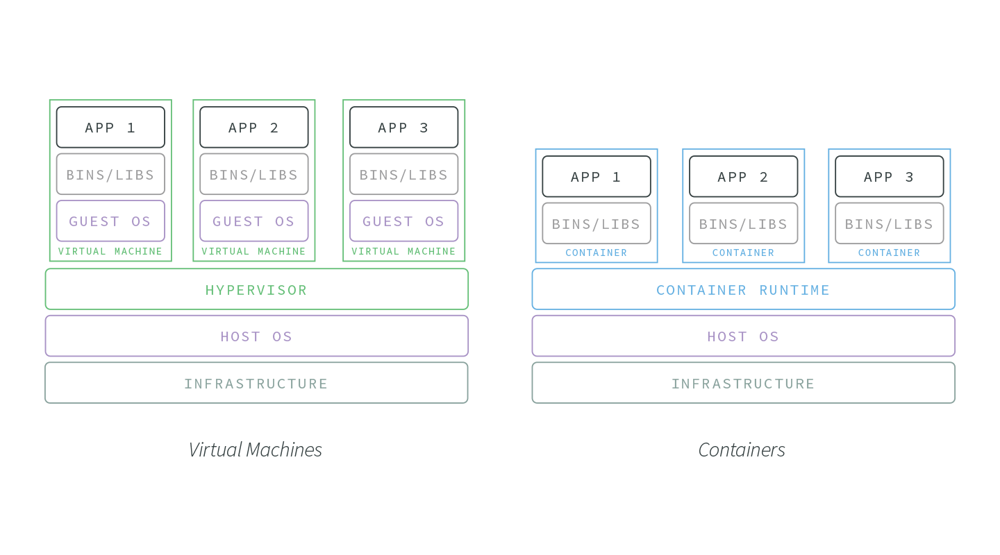

Les conteneurs d’applications ont émergé comme un outil puissant dans le développement de logiciels modernes. Plus légers et plus économes en ressources que les machines virtuelles traditionnelles, les conteneurs offrent aux organisations informatiques de nouvelles opportunités dans le contrôle de version, le déploiement, la graduation (scaling) et la sécurité.

Ce post traitera de ce que sont exactement les conteneurs, pourquoi ils se révèlent si avantageux, comment les utilisateurs les utilisent et des meilleures pratiques pour conteneuriser vos applications Node.js avec Docker.

## Qu’est-ce qu’un conteneur?

En termes simples, les conteneurs **exécutent des instances d’ images de conteneur**. Les images sont des alternatives en couches aux disques de machines virtuelles (VMD) qui permettent aux applications d’être extraites de l’environnement dans lequel elles sont réellement exécutées. Les images conteneur sont exécutables, logiciel isolé avec accès aux ressources de l’hôte, au réseau et au système de fichiers. Ces images sont créées avec leurs propres outils système, bibliothèques, code, environnement d’exécution et dépendances associées codées en dur. Cela permet aux conteneurs d’être filés indépendamment de l’environnement. Cette approche “tout-en-un” aide à résoudre les problèmes d’application indépendante, en améliorant la sécurité des systèmes et en facilitant le débogage.

Contrairement aux machines virtuelles traditionnelles, les images de conteneur donnent à chacune de ses instances un accès partagé au système d’exploitation hôte via une exécution de conteneur. Cet accès partagé aux ressources du système hôte permet d’obtenir des performances et des ressources qui ne sont pas trouvées dans d’autres méthodes de virtualisation.

Imaginez une image de conteneur qui nécessite 500 Mo. Dans un environnement conteneurisé, ces 500 Mo peuvent être partagés entre des centaines de conteneurs en supposant qu’ils fonctionnent tous sur la même image de base. D’un autre côté, les machines virtuelles auraient besoin de 500 Mo par machine virtuelle . Cela rend les conteneurs beaucoup plus adaptés aux _horizontal scaling_ et aux environnements restreints aux ressources.

## Pourquoi les conteneurs d’applications?

La légèreté et la reproductibilité des conteneurs en ont fait une option de plus en plus utilisée par les entreprises souhaitant développer des applications logicielles évolutives, hautement disponibles et contrôlées par les versions.

Les conteneurs offrent plusieurs avantages clés aux développeurs:

- **Léger et économe en ressources**. Par rapport aux machines virtuelles, qui génèrent des copies de leur système d’exploitation hôte pour chaque application ou processus, les conteneurs ont nettement moins d’impact sur la mémoire, l’utilisation du processeur et l’espace disque.
- **Immuable**. Les conteneurs sont générés à partir d’une seule source vérifiée, une image. Si des modifications sont validées sur une image, une nouvelle image est créée . Cela rend les changements d’image de conteneur faciles à suivre et les restaurations de déploiement intuitives. La reproductibilité et la stabilité des conteneurs permettent aux équipes de développement d’éviter la dérive de la configuration, ce qui simplifie considérablement le test de version et la mise en miroir des environnements de développement et de production.
- **Portable**. La nature isolée et autonome des conteneurs en fait un excellent choix pour les applications qui doivent fonctionner sur une multitude de services, de plates-formes et d’environnements. Ils peuvent fonctionner sous Linux, Windows et macOS. Fournissez-les depuis le cloud, sur site ou là où votre infrastructure l’exige.
- **Évolutif et hautement disponible**. Les conteneurs sont facilement reproductibles et peuvent répondre dynamiquement aux demandes de trafic, grâce aux services d’orchestration tels que les instances de conteneur [Azure](https://azure.microsoft.com/en-us/services/container-instances/), [Google Cloud Engine](https://cloud.google.com/compute/) et [Amazon ECS](https://aws.amazon.com/ecs/), qui facilitent et accélèrent la création ou le retrait de conteneurs de votre infrastructure.

## Cas d’utilisation de conteneurs d’applications

Toutes les applications et les organisations n’auront pas les mêmes besoins en infrastructure. Les avantages susmentionnés des conteneurs les rendent particulièrement aptes à répondre aux besoins suivant:

### DEVOPS ORGANISATIONS

Pour les équipes qui travaillent à pratiquer «l’infrastructure comme code» et qui cherchent à adopter le paradigme DevOps, les conteneurs offrent des opportunités inégalées. Leur portabilité, leur résistance à la dérive de configuration et leur temps de démarrage rapide font des conteneurs un excellent outil pour tester rapidement et de manière reproductible différents environnements de code, indépendamment de la machine ou de l’emplacement.

### MICROSERVICE ET ARCHITECTURES DISTRIBUÉES

Une expression courante dans le développement de microservices est «faites une chose et faites-le bien», et cela s’harmonise étroitement avec les conteneurs d’applications. Les conteneurs offrent un excellent moyen d’envelopper les microservices et de les isoler de l’environnement d’application plus large. Ceci est très utile lorsque vous souhaitez mettre à jour des (micro-) services spécifiques d’une suite d’applications sans mettre à jour l’ensemble de l’application.

### TESTS A / B

Les conteneurs facilitent le déploiement de plusieurs versions de la même application. Lorsqu’ils sont associés à des déploiements incrémentaux , les conteneurs peuvent maintenir votre application dans un état dynamique et réactif aux tests. Voulez-vous tester une nouvelle fonctionnalité de performance? Faites défiler un nouveau conteneur, ajoutez des mises à jour, acheminez 1% du trafic vers celui-ci et collectez des commentaires sur les utilisateurs et les performances. À mesure que les changements se stabilisent et que votre équipe décide de l’appliquer à l’application en général, les conteneurs peuvent rendre cette transition fluide et efficace.

## Conteneurs et Node.js

En raison de la pertinence des conteneurs d’applications pour les environnements d’application ciblés, Node.js est sans doute le meilleur moteur d’exécution pour la conteneurisation.

- **Dépendances explicites**. Les applications Node.js conteneurisées peuvent verrouiller les arborescences de dépendance et gérer des fichiers stables package.json , package-lock.json ou npm-shrinkwrap.json .
- **Démarrage rapide et redémarrage**. Les conteneurs sont légers et démarrent rapidement, ce qui en fait une paire stratégique pour les applications Node.js. L’une des fonctionnalités les plus appréciées de Node.js est son temps de démarrage impressionnant. Cette performance de démarrage robuste obtient des processus terminés redémarrés rapidement et les applications stabilisées; La conteneurisation fournit une solution évolutive pour maintenir cette performance.
- **Scaling au niveau du processus**. Semblable à la meilleure pratique de Node.js consistant à faire tourner plus de processus au lieu de plus de threads, un environnement conteneurisé augmentera le nombre de processus en augmentant le nombre de conteneurs. Cet _horizontal scaling_ crée de la redondance et permet de maintenir les applications hautement disponibles, sans le coût significatif des ressources d’une nouvelle machine virtuelle par processus.

# Dockeriser votre application Node.js

## Présentation de Docker

Docker est un système de fichiers en couches pour l’envoi d’images, et permet aux organisations d’abstraire leurs applications de leur infrastructure.

Avec Docker, les images sont générées via un fichier Docker. Ce fichier fournit des configurations et des commandes pour générer des images par programme.

Chaque commande Docker dans un Dockerfile ajoute un ‘calque’. Plus il y a de couches, plus le conteneur résultant est grand.

Voici un exemple simple de Dockerfile:

`gist:ludovicwyffels/319ac2d2b4214ca0b39981da50743a99`

La commande `FROM` désigne l'image de base qui sera utilisée; dans ce cas, il s'agit de l'image de la ligne de lancement Node.js 8 LTS.

La commande `RUN` prend les commandes bash comme arguments. Dans la ligne 2, nous créons un répertoire pour placer l'application Node.js. La ligne 3 indique à Docker que le répertoire de travail pour chaque commande après la ligne 3 sera le répertoire de l'application. La ligne 5 copie tout le répertoire courant dans le répertoire courant de l'image, qui est `/home/nodejs/app` précédemment défini par la commande WORKDIR de manière similaire. Sur la ligne 6, nous installons l'installation de production.

Enfin, sur la ligne 8, nous transmettons à Docker une commande et un argument pour exécuter l’application Node.js à l’intérieur du conteneur.

L’exemple ci-dessus fournit un Dockerfile de base, mais finalement problématique.

Dans la section suivante, nous examinerons certaines des meilleures pratiques de Dockerfile pour exécuter Node.js en production.

## Meilleures pratiques Dockerfile

### NE PAS EXÉCUTER L’APPLICATION EN TANT QUE ROOT

Assurez-vous que l’application exécutée dans le conteneur Docker n’est pas exécutée en tant que `root`.

`gist:ludovicwyffels/6237f74e2cfebbbbd6247c27c4fa1310`

Dans l’exemple ci-dessus, quelques lignes de code ont été ajoutées à l’exemple Dockerfile d’origine pour extraire l’image de la dernière version LTS de Node.js, ainsi que pour ajouter et définir un nouvel utilisateur, `nodejs` . De cette façon, dans le cas où une vulnérabilité de l'application est exploitée, et que quelqu'un réussit à entrer dans le conteneur au niveau du système, au mieux, ce sont des utilisateurs `nodejs` qui n'ont pas d'autorisations root et n'existent pas sur l'hôte.

### CACHE NODE_MODULES

Docker construit chaque ligne d’un Dockerfile individuellement. Cela forme les “couches” de l’image Docker. Au fur et à mesure qu’une image est construite, Docker met en cache chaque couche.

`gist:ludovicwyffels/b010c5e5ab987804b89dff82ed98cf45`

Sur la ligne 9 du Dockerfile ci-dessus, le fichier package.json est copié dans le répertoire de travail établi sur la ligne 7. Après le `npm install` sur la ligne 10, la ligne 11 copie le répertoire courant dans le répertoire de travail (l'image).

Si aucune modification n’est apportée à votre package.json , Docker ne reconstruira pas la couche d’image `npm install`, ce qui peut considérablement améliorer les temps de construction.

### CONFIGUREZ VOTRE ENVIRONNEMENT

Il est important de définir explicitement les variables d’environnement que votre application Node.js s’attend à rester constante tout au long du cycle de vie du conteneur.

`gist:ludovicwyffels/27412e8ac874b059a5a509acfe757705`

> [DockerHub](https://hub.docker.com/) fournit une ressource centralisée pour la découverte d’images de conteneur, la distribution et la gestion des modifications, la collaboration entre utilisateurs et équipes et l’automatisation du flux de travail tout au long du pipeline de développement’.
> Pour associer la CLI Docker à votre compte DockerHub, utilisez la `docker login`
>
> `docker login [OPTIONS] [SERVER]` : `docker login [OPTIONS] [SERVER]`

### COMPTES GITHUB PRIVÉS ET MODULES NPM

Docker exécute ses builds à l’intérieur d’un sandbox et cet environnement sandbox n’a pas accès à des informations telles que les clés ssh ou les informations d'identification npm. Pour contourner cette contrainte, quelques options recommandées sont disponibles pour les développeurs:

- **Stocker les clés et les informations d’identification sur le système CI / CD**. Les problèmes de sécurité d’avoir des informations d’identification sensibles à l’intérieur de la construction Docker peuvent être évités entièrement en ne les mettant jamais là en premier lieu. Au lieu de cela, stockez-les et récupérez-les dans le système CI / CD de votre infrastructure, et copiez manuellement les dépendances privées dans l’image.
- **Utilisez un serveur npm interne**. À l’aide d’un outil comme Verdaccio, configurez un proxy npm qui garde le flux des modules internes et des informations d’ identification privées .

### SOYEZ EXPLICITE AVEC LES TAGS
Les balises aident à différencier les différentes versions d’images. Les balises peuvent être utilisées pour identifier les builds, les équipes qui travaillent sur l’image et littéralement toute autre désignation utile à une organisation pour gérer le développement des images. Si aucune balise n’est ajoutée explicitement, Docker assignera une balise par défaut à `latest` après la `docker build`. En tant que tag, le développement est le latest en date, mais peut être très problématique dans les environnements de production et de mise en scène.

Pour éviter les problèmes `latest` , **soyez explicites avec vos balises de construction**. Voici un exemple de script attribuant des balises avec des variables d'environnement pour le git sha, le nom de la branche et le numéro de build de la construction, tous les trois pouvant être très utiles dans la gestion des versions, du débogage et du déploiement:

`gist:ludovicwyffels/70fdd653abba16c4451c0781f6dd9fc5`

En savoir plus sur le marquage [ici](https://docs.docker.com/get-started/part2/#tag-the-image).

## Conteneurs et gestion des processus

Les conteneurs sont conçus pour être légers et bien adaptés au niveau du processus, ce qui contribue à simplifier la gestion des processus: si le processus se termine, le conteneur se ferme. Cependant, cette cartographie 1:1 est une idéalisation qui n’est pas toujours maintenue dans la pratique.

Comme les conteneurs Docker ne sont pas fournis avec un gestionnaire de processus, ajoutez un outil pour une gestion simple des processus.

[dumb-init](https://github.com/Yelp/dumb-init) de Yelp est un superviseur de processus simple et léger et un système d’initialisation conçu pour fonctionner en tant que `PID 1` dans des environnements de conteneur. Cette désignation `PID 1` pour le processus dumb-init est normalement affectée à un conteneur Linux en cours d'exécution et possède ses propres idiosyncrasies de signalisation du noyau qui compliquent la gestion des processus. Dumb-init fournit un niveau d'abstraction qui lui permet d'agir comme un proxy de signal, assurant le comportement attendu du processus.

## Ce qu’il faut inclure dans vos conteneurs d’applications

Le principal avantage des conteneurs est qu’ils ne fournissent que ce qui est nécessaire. Gardez cela à l’esprit lorsque vous ajoutez des calques à vos images.

Voici une liste de contrôle à inclure lors de la création d’images de conteneur:

- Votre code d’application et ses dépendances.
- Variables d’environnement nécessaires.
- Un proxy de signal simple pour la gestion de processus, comme dumb-init.
C’est tout.

## Conclusion

Les conteneurs sont une solution de virtualisation moderne mieux adaptée aux infrastructures nécessitant un partage efficace des ressources, des délais de démarrage rapides et une mise à l’échelle rapide.

Les organisations DevOps utilisent des conteneurs d’applications pour implémenter ‘l’infrastructure en tant que code’, des équipes développant des microservices et s’appuyant sur des architectures distribuées et des groupes d’assurance qualité (QA) tirant parti de stratégies telles que les tests A/B et les déploiements incrémentaux en production.

Tout comme l’approche recommandée pour Node.js monothread est 1 processus: 1 application, la meilleure pratique pour les conteneurs d’applications est 1 processus: 1 conteneur. Cette relation en miroir fait sans doute de Node.js l’environnement d’exécution le plus approprié pour le développement de conteneurs.

Docker est une plate-forme ouverte pour le développement, l’expédition et l’exécution d’applications conteneurisées. Docker vous permet de séparer vos applications de votre infrastructure afin de pouvoir livrer des logiciels rapidement. Lorsque vous utilisez Docker avec Node.js, gardez à l’esprit:

- Ne lancez pas l’application en tant que `root`
- Cache `node_modules`
- Utilisez votre système CI / CD ou un serveur interne pour conserver les informations d’identification sensibles hors de l’image du conteneur
- Soyez explicite avec les balises de construction
- Gardez les récipients *légers* !
