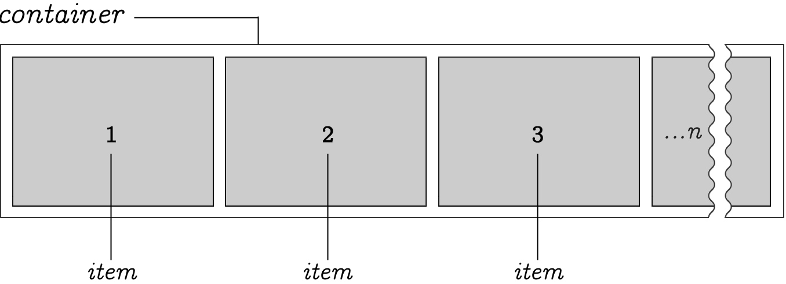
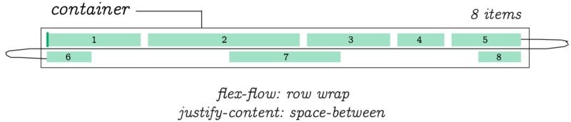
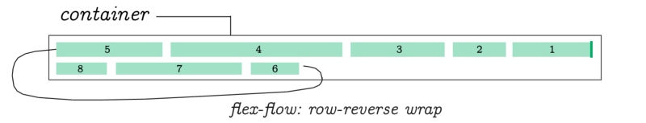
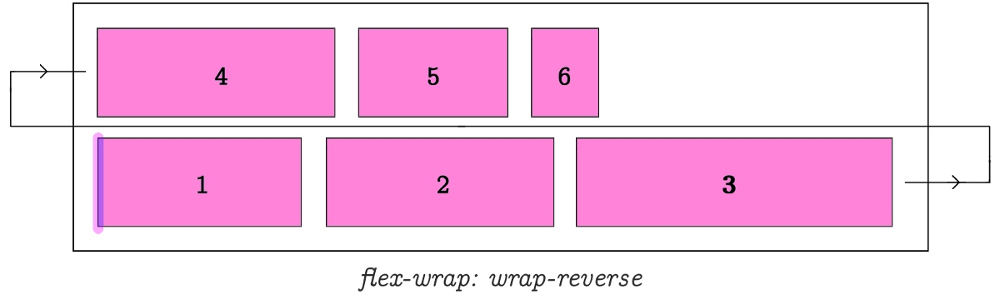
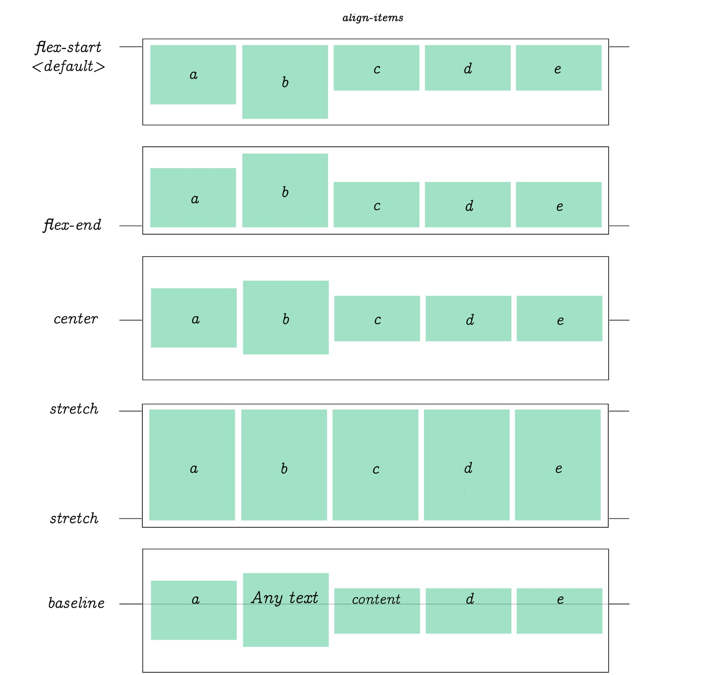
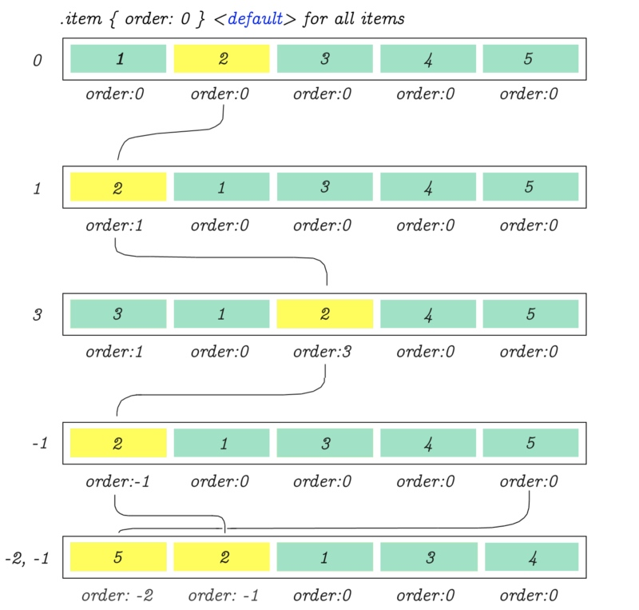

## Flex
Flex est un ensemble de règles pour étirer automatiquement plusieurs colonnes et lignes de contenu dans son conteneur parent.

## display:flex
Contrairement à de nombreuses autres propriétés CSS, vous disposez d'un conteneur principal et d'éléments imbriqués dans Flex. Certaines propriétés CSS flex sont utilisées uniquement sur le parent. D'autres seulement sur les items.


Vous pouvez considérer un élément flex comme un conteneur parent avec **display: flex**. Les éléments placés à l'intérieur de ce conteneur sont appelés items. Chaque conteneur a un point **flex-start** et **flex-end** comme indiqué dans le diagramme ci-dessus.

## Axe principal et axe croisé

Alors que la liste des items est fournie de manière linéaire, Flex vous oblige à tenir compte des lignes et des colonnes. Pour cette raison, il a deux axes de coordonnées. L'axe horizontal est appelé axe principal (Main-Axis) et la verticale est l'axe croisé (Cross-Axis).

Pour contrôler le comportement de la largeur du contenu et des écarts entre les deux, et pour lui permettre de s'étendre horizontalement sur l'axe principal, vous utiliserez des propriétés de justification. Pour contrôler le comportement vertical des éléments, vous utiliserez les propriétés d'alignement.

Si vous avez 3 colonnes et 6 éléments, une deuxième ligne sera créée automatiquement par Flex pour accueillir les items restants.

Si vous avez répertorié plus de 6 éléments, d'autres lignes seront créées.


Les éléments Flex sont également répartis sur l'axe principal. Nous allons examiner les propriétés et les valeurs pour y parvenir dans un instant.


> Vous pouvez déterminer le nombre de colonnes.

La façon dont les lignes et les colonnes sont distribuées dans l'élément parent est déterminée par les propriétés CSS Flex **flex-direction, flex-wrap** et quelques autres qui seront démontrées tout au long de cet article.



Ici, nous avons un nombre n arbitraire d'éléments placés dans un conteneur. Par défaut, les éléments s'étendent de gauche à droite. Cependant, le point d'origine peut être inversé.

## Direction
Il est possible de définir la direction du flex de l'élément en l'inversant.


**flex-direction:row-reverse** change la direction du flux de la liste d'éléments. La valeur par défaut est row, ce qui veut dire que ça va de gauche à droite, comme on s'y attendrait!

```css
.container {
  flex-direction: row | row-reverse | column | column-reverse;
}
```

## Wrap


```css
.container{
  flex-wrap: nowrap | wrap | wrap-reverse;
}
```

**flex-wrap:wrap** détermine comment les éléments sont encapsulés lorsque le conteneur parent manque d'espace.

## Flow


```css
flex-flow: <‘flex-direction’> || <‘flex-wrap’>
```

**flex-flow** est un raccourci pour **flex-direction** et **flex-wrap**, vous permettant de spécifier les deux en utilisant un seul nom de propriété.


```css
.container {
  flex-flow: row wrap
}
```

**flex-flow:row wrap** détermine **flex-direction** à être **row** et **flex-wrap** à être **wrap**.


```css
.container {
  flex-flow: row wrap-reverse
}
```



```css
.container {
  flex-flow:row wrap; 
  justify-content: space-between;
}
```



```css
.container {
  flex-flow:row-reverse wrap;
}
```


```css
.container {
  flex-flow:row-reverse wrap-reverse;
}
```


```css
.container {
  flex-flow:row wrap; 
  justify-content: space-between;
}
```


```css
.container {
  flex-direction: column;
}
```

```css
.container {
  flex-direction: column-reverse;
}
```

Lorsque nous changeons la direction du flex en colonne, la propriété **flex-flow** se comporte exactement de la même manière que dans les exemples précédents. Sauf cette fois, ils suivent la direction verticale d'une colonne.



```css
.container {
  flex-wrap: wrap-reverse
}
```

## justify-content


```css
.container {
  flex-direction:row;
  justify-content: flex-start | flex-end | center | space-between | space-around | space-evenly;
}
```

Dans cet exemple, nous n'utilisons que 3 éléments par ligne. Il n'y a aucune limite sur le nombre d'articles que vous souhaitez utiliser en flex. Ces diagrammes montrent uniquement le comportement des éléments lorsque l'une des valeurs répertoriées est appliquée à la propriété **justify-content**.


```css
.container {
  flex-direction:column;
  justify-content: flex-start | flex-end | center | space-between | space-around | space-evenly;
}
```

la même propiété **justify-content** est utilisée pour aligner les éléments lorsque **flex-direction** est en colonne.

## Packing flex lines (selon la spécification Flex)


```css
.container {
  flex-direction: row;
  align-content: flex-start | flex-end | center | baseline | stretch;
}
```

La spécification Flex se réfère à ceci comme "**packing flex lines**". Fondamentalement, cela fonctionne exactement comme les exemples que nous avons vu dans les images précédentes. Sauf cette fois, notez que l'espacement est entre les ensembles entiers d'articles. Ceci est utile lorsque vous souhaitez créer des vides autour d'un lot de plusieurs éléments.


```css
.container {
  flex-direction: column;
  align-content: flex-start | flex-end | center | baseline | stretch;
}
```

> Packing Flex Lines (suite.) Mais maintenant avec flex-direction: column.

## align-items



```css
.container {
  align-items: flex-start | flex-end | center | baseline | stretch;
}
```
align-items contrôle l'alignement des éléments horizontalement par rapport au conteneur parent

## flex-basis


```css
.item {
  flex-basis: <length> | auto; /* default auto */
}
```

**flex-basis** fonctionne de manière similaire à une autre propriété CSS: min-width outside of flex. Il va augmenter la taille d'un objet en fonction du contenu interne. Sinon, la valeur de base par défaut sera utilisée.

## flex-grow


```css
.item {
  flex: none | [ <'flex-grow'> <'flex-shrink'>? || <'flex-basis'> ]
}
```

**flex-grow**, lorsqu'il est appliqué à un élément, il est mis à l'échelle par rapport à la somme de la taille de tous les autres éléments de la même ligne, qui sont automatiquement ajustés en fonction de la valeur spécifiée. Dans chaque exemple, la valeur flex-grow de l'élément a été définie sur 1, 7 et (3 et 5) dans le dernier exemple.

## flex-shrink


```css
.item {
  flex-shrink: <number>; /* default 1 */
}
```

flex-shrink est le contraire de flex-grow. Dans cet exemple, une valeur de 7 a été utilisée pour "réduire" l'élément sélectionné dans la quantité égale à 1/7 de la taille de ses éléments environnants - qui seront également ajustés automatiquement.


Lorsque vous traitez des éléments individuels, vous pouvez utiliser la propriété flex comme raccourci pour **flex-grow**, **flex-shrink** et **flex-basis** en utilisant un seul nom de propiété.

## order

En utilisant la propriété order, il est possible de réorganiser l'ordre naturel des objets.



```css
.item {
  order: <integer>; /* default is 0 */
}
```

## justify-items


```css
.item {
  justify-items: auto | stretch | center | start | end;
} 
```
