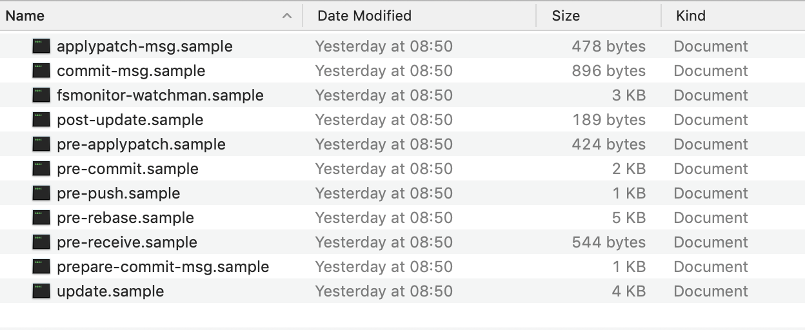

Dans cet article, vous apprendrez à créer et à gérer facilement des git hooks pour vos projets Node/NPM à l'aide de Husky.

## Git Hooks

En termes simples, les git hooks sont des scripts personnalisés, qui peuvent être exécutés automatiquement lorsque des événements spécifiques se produisent. Des crochets (hooks) côté client sont déclenchés pour des actions telles que le commit ou le merge. Les crochets côté serveur s'exécutent dans des situations telles que la réception de données (`git push`) du client.

Les hooks peuvent exécuter n'importe quelle logique personnalisée et, plus important encore, rejeter l'action effectuée si quelque chose ne va pas. Par exemple, vous pouvez annuler la validation du commit si son message ne contient pas l'ID de problème du suivi des problèmes. Vous pouvez également le refuser si l'analyse de code statique échoue. Cela peut être très utile si vous voulez vous assurer que votre base de code reste propre ou si vous souhaitez appliquer certaines règles de qualité.

Mais comment pouvez-vous réellement installer et gérer ces hooks? Chaque fois que vous clonez un repo git, toutes les données git de votre projet sont stockées dans un répertoire `.git` dans votre dossier. Il contient plusieurs fichiers et sous-répertoires, l'un d'eux étant appelé `hooks`. À l'intérieur, vous trouverez un tas de fichiers.



Chacun d'entre eux est un script, qui est exécuté lorsqu'un événement spécifique se produit. Le nom de l'événement correspond au nom du fichier. Par exemple, la `pre-commit` est exécutée avant de commiter vos modifications.

Comme vous pouvez le constater, tous les fichiers ont une extension `.sample`. Git ignore ces fichiers à moins que vous ne les renommiez. Vous devez supprimer l'extension `.sample` pour activer ces hooks. Dans les exemples de fichiers, vous pouvez trouver une description et un exemple d'implémentation que vous pouvez utiliser comme point de départ pour implémenter vos propres hooks.

## À quoi ça sert?

Maintenant, regardons quelques exemples spécifiques de ce qui peut être réalisé avec les git hooks. Comme ce ne sont que des scripts, vous pouvez faire à peu près n'importe quoi. Habituellement, cela signifie effectuer divers contrôles de qualité.

Vous pouvez vous assurer que l'utilisateur a son nom et son email renseignés. Vous pouvez vérifier que le message de validation est correctement formaté. Vous pouvez essayer de créer votre application et rejeter le commit si la construction échoue. Vous pouvez exécuter des tests pour vous assurer qu'ils passent avant le commit.

L'utilisation typique est également l'analyse de code statique ou le formatage. Cela signifie qu’il faut vérifier dans votre code les problèmes courants, les mauvaises pratiques, les conventions de dénomination, etc. Il peut également être utile d’exécuter un outil tel que Prettier pour s’assurer que le code est bien formaté avant le commit. Cela évite de nombreux maux de tête lors de la révision du code. Vous pouvez même vérifier les failles de sécurité de votre code avec un outil tel que Snyk.

## Distribution aux membres de l'équipe
Avec les hooks côté serveur, la distribution est facile. Vous n'avez généralement qu'un seul référentiel de serveur principal. Cela signifie que tous les membres de l’équipe mettent généralement leurs modifications au même endroit. Vous y installez vos hooks et vous avez terminé.

Avec les hooks côté client, cela devient plus compliqué. Lorsque vous clonez un référentiel, les hooks ne sont pas transférés au client. Cela signifie qu'un référentiel fraîchement cloné n'a aucun hook, peu importe le type de hook que vous avez sur le serveur. Si vous voulez que les membres de votre équipe aient un ensemble unifié de git hooks, vous devez les distribuer d'une manière ou d'une autre et vous assurer qu'ils sont inclus dans leur sous-répertoire git hooks.

La solution la plus élémentaire consiste à créer un emplacement partagé, où vous stockez vos hooks, puis demandez à vos développeurs de les télécharger et de les mettre dans leur répertoire de hooks. Bien sûr, vous ne pouvez pas être sûr qu'ils le feront réellement. Le problème est qu'ils ont besoin de savoir qu'ils devraient le faire et comment. Et même s'ils le font, ils peuvent être paresseux ou simplement ignorer votre politique.

Vous pouvez améliorer un peu cette solution de base en ayant des hooks dans le référentiel de votre projet et en laissant simplement à vos développeurs exécuter un script personnalisé [comme celui-ci](https://gist.github.com/tilap/0590e78c9cfd8f6548f5), qui les copie ensuite dans leur répertoire de hooks. Sinon, git propose une option pour changer la destination du répertoire des hooks en un emplacement personnalisé:

```bash
git config core.hooksPath YOUR_DIRECTORY
```

Ces solutions facilitent la distribution, mais ne résolvent pas les problèmes essentiels.

## Husky

### Installation

Vous pouvez installer [Husky](https://github.com/typicode/husky) simplement en exécutant:

```bash
npm install husky --save-dev
```

Alternative, avec yarn:

```bash
yarn add husky --dev
```

### Ajout de hooks

Ajouter des hooks avec Husky est facile. Vous devez juste éditer votre `package.json`. Vous définissez quels scripts doivent être exécutés sur quel événement git.

Pour Husky 1.0.0+, utilisez:

```json
{
  "husky": {
    "hooks": {
      "pre-commit": "npm test",
      "pre-push": "npm test",
      "...": "..."
    }
  }
}
```

Si vous utilisez une version de Husky antérieure à 1.0.0 (disponible dans la version candidate du 06/2018), la syntaxe est légèrement différente. Vous ajoutez vos hooks Husky directement dans la section scripts.

```json
{
  "scripts": {
    "precommit": "npm test",
    "prepush": "npm test",
    "...": "..."
  }
}
```

L'exemple ci-dessus exécute tous vos tests avant de commiter et avant de pousser et si vos tests échouent, l'action git n'est pas exécutée. Bien sûr, vous pouvez exécuter tout autre script nom plutôt que le `nom test`.

### Problème de correction automatique avant validation

Il est utile de casser le build si quelque chose ne va pas, mais il est encore plus utile de corriger automatiquement les problèmes avant de s’engager. Par exemple, vous pouvez personnaliser votre code en utilisant [Prettier](https://prettier.io/) avant de faire un commit ou vous pouvez corriger automatiquement les problèmes de formatage, qui peuvent être résolus automatiquement. C'est beaucoup plus facile de cette façon.

Heureusement, il existe un outil pour cela. Cela s'appelle [lint-staged](https://github.com/okonet/lint-staged). Vous pouvez l'installer par:

```bash
npm installer --save-dev lint-staged
```

Maintenant, sur votre action de pre-commit, vous exécutez directement `lint-staged` au lieu de votre linter. Dans `lint-staged`, vous définissez ce qui doit être exécuté:

```json
{
  "husky": {
    "hooks": {
      "pre-commit": "lint-staged"
    }
  },
  "lint-staged": {
    "*.js": ["eslint --fix", "git add"]
  }
}
```

Lorsque vous essayez de commiter maintenant, `lint-staged` peut modifier vos fichiers avant l'exécution de la validation. Cependant, ce qui est vraiment bien, c'est que vous ne filtrez que les fichiers en attente de validation, et non l'ensemble de votre projet. Cela signifie que l'ensemble du processus est beaucoup plus rapide.

## Bug JetBrains IDE

La bonne nouvelle est que les git hooks configurés de cette manière sont exécutés non seulement lorsque vous utilisez git à partir de votre terminal, mais également à partir d'un IDE. La mauvaise nouvelle est que les IDE JetBrains (IDEA, Webstorm, ...) ont actuellement un [méchant bogue](https://github.com/okonet/lint-staged/issues/151) (voir [IDEA-135454](https://youtrack.jetbrains.com/issue/IDEA-135454)) et ne fonctionnent pas bien avec cette configuration.

Le problème n'est pas résolu avant plusieurs années, mais heureusement, il existe une solution de contournement. Vous devez juste ajouter ce hook post-commit:

```json
"post-commit": "git update-index -g"
```

Bien entendu, il ne s'agit que d'une solution de contournement jusqu'à ce que le problème soit résolu. Le suivi des problèmes de JetBrains contient une fonctionnalité de vote, alors assurez-vous de voter pour que ce problème soit résolu s'il vous pose problème.

## Intégration continue

Une chose à noter est que Husky installe les hooks uniquement lorsqu'il ne s'exécute pas sur un serveur d'intégration continue. Husky [peut détecter](https://github.com/watson/is-ci) qu'il est en cours d'exécution dans le cadre d'un travail CI et n'installe aucun hook.

## En ignorant

Les hooks côté client peuvent être utiles, mais vous ne pouvez pas trop compter sur eux. Ils ne sont que le premier niveau de défense. Vous ne pouvez pas être sûr à 100% qu'ils soient exécutés. Ils peuvent être ignorés à la demande en ajoutant une option de ligne de commande:

```bash
git commit --no-verify
```

Pour rendre les choses encore plus faciles, les hooks peuvent être désactivés à l'aide de certaines variables environnementales. Pour cette raison, il est toujours utile d'appliquer la même fonctionnalité sur le serveur.

## Performance

Bien que les hooks cotés client tels que le pre-commit puissent s'avérer très utiles, vous devez garder à l'esprit qu'ils prennent un certain temps à s'exécuter. Les commits, qui sont généralement très rapides, car ils ne se produisent que sur le client, peuvent prendre soudainement très longtemps. Vous serez peut-être tenté d'exécuter tous les tests, l'analyse de code statique, les vérifications préalables, etc., avant chaque validation. Lorsqu'un commit prend des années, vos développeurs ne seront pas heureux et seront tentés d'ignorer les hooks lors de l'exécution de leurs commandes git. Vous devez donc trouver le bon équilibre entre ce qui doit être effectué sur le client et ce qui peut être un point d’accès côté serveur.

## Conclusion

Husky est un outil utile qui permet de créer et de gérer facilement des hooks git sur le client. Vous n'avez plus besoin de distribuer vos hooks manuellement. Comme pour tout, gardez le nombre de hooks côté client avec modération afin d'éviter les temps d'exécution trop longs.
