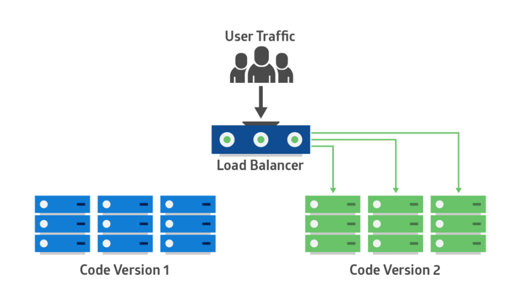

De nos jours, le changement le plus important dans le développement logiciel est la fréquence des déploiements. Les équipes de produits déploient les versions en production plus tôt (et plus souvent). Des cycles de publication de plusieurs mois ou années sont en train de devenir rares, en particulier parmi ceux qui construisent des produits logiciels purs.

Aujourd'hui, en utilisant une approche axée sur les services et sur les microservices, les développeurs peuvent concevoir une base de code modulaire. Cela leur permet d'écrire et de déployer des modifications simultanément sur différentes parties de la base de code.

Les avantages commerciaux de cycles de déploiement plus courts sont clairs:

- Le temps de mise sur le marché est réduit
- Les clients obtiennent la valeur du produit en moins de temps
- Les commentaires des clients sont également renvoyés plus rapidement dans l'équipe produit, ce qui permet à l'équipe de parcourir les fonctionnalités et de résoudre les problèmes plus rapidement.
- Le moral des développeurs augmente

Cependant, ce changement crée également de nouveaux défis pour les opérations ou l'équipe de DevOps. Avec des déploiements plus fréquents, il est plus probable que le code déployé puisse affecter négativement la fiabilité du site ou l'expérience client. C’est pourquoi il est important de développer des stratégies de déploiement de code minimisant les risques pour le produit et les clients.

Dans cet article, nous allons parler de différentes stratégies de déploiement, de meilleures pratiques et d’outils qui permettront à votre équipe de travailler plus rapidement et de manière plus fiable.

## Défis des applications modernes

Les applications modernes sont souvent distribuées et basées sur le cloud. Ils peuvent évoluer pour répondre à la demande et sont plus résistants aux pannes grâce à des architectures hautement disponibles. Ils peuvent utiliser des services entièrement gérés comme AWS Lambda ou Elastic Container Service (ECS), où la plate-forme assume une partie de la responsabilité opérationnelle.

Ces applications ont presque toujours des déploiements fréquents. Par exemple, une application mobile ou une application Web grand public peut subir plusieurs modifications au cours d'un mois. Certains sont même déployés en production plusieurs fois par jour.

Ils utilisent souvent des architectures de microservices dans lesquelles plusieurs composants travaillent ensemble pour offrir une fonctionnalité complète. Il peut y avoir différents cycles de publication pour différents composants, mais ils doivent tous fonctionner ensemble de manière transparente.

L'augmentation du nombre de pièces mobiles signifie plus de chances que quelque chose se passe mal. Avec plusieurs équipes de développement apportant des modifications dans la base de code, il peut être difficile de déterminer la cause première d'un problème inévitablement.

Un autre défi: l'abstraction de la couche infrastructure, qui est maintenant considérée comme du code. Le déploiement d'une nouvelle application peut également nécessiter le déploiement d'un nouveau code d'infrastructure.

## Stratégies de déploiement populaires

Pour relever ces défis, les équipes chargées des applications et de l'infrastructure doivent concevoir et adopter une stratégie de déploiement adaptée à leur cas d'utilisation.

Nous en examinerons plusieurs et discuterons des avantages et des inconvénients de différentes stratégies de déploiement afin que vous puissiez choisir celle qui convient à votre organisation.

## Déploiement "Big Bang"

Comme son nom l'indique, les déploiements "big bang" mettent à jour des parties entières ou volumineuses d'une application en un seul coup. Cette stratégie remonte à l'époque où le logiciel était publié sur un support physique et installé par le client.

Les déploiements à grande échelle ont obligé l’entreprise à procéder à des développements et à des tests approfondis avant la publication, souvent associés au "modèle en cascade" de grandes versions séquentielles.

Les applications modernes présentent l'avantage de se mettre à jour régulièrement et automatiquement, côté client ou côté serveur. Cela rend l'approche big bang plus lent et moins agile pour les équipes modernes.

Les caractéristiques du déploiement du Big Bang comprennent:

- Toutes les pièces majeures conditionnées en un seul déploiement;
- Remplacer en grande partie ou totalement une version de logiciel existante par une nouvelle;
- Déploiement entraînant généralement de longs cycles de développement et de test;
- En supposant un risque minimal d'échec, les retours en arrière peuvent être impossibles ou peu pratiques;
- Les délais de réalisation sont généralement longs et peuvent nécessiter les efforts de plusieurs équipes;
- Action requise des clients pour mettre à jour l'installation côté client.

Les déploiements à fort rendement ne conviennent pas aux applications modernes, car les risques sont inacceptables pour les applications grand public ou critiques pour les entreprises, où les pannes entraînent des pertes financières énormes. Les reculs sont souvent coûteux, prennent du temps, voire impossibles.

L’approche big bang peut convenir à des systèmes hors production (par exemple, recréer un environnement de développement) ou à des solutions prêtes à l’emploi, tel que les applications de bureau.

## Déploiement progressif (Rolling)

Les déploiements progressifs, par paliers ou par étapes sont préférables aux déploiements big bang, car ils minimisent de nombreux risques, y compris les temps d'arrêt pour les utilisateurs, sans restauration simple.

Dans un déploiement en continu, la nouvelle version d’une application remplace progressivement l’ancienne. Le déploiement réel se produit sur une période de temps. Pendant ce temps, les nouvelles versions et les anciennes versions coexisteront sans affecter la fonctionnalité ou l'expérience utilisateur. Ce processus facilite la restauration de tout nouveau composant incompatible avec les anciens composants.

Le diagramme suivant illustre le modèle de déploiement: l'ancienne version apparaît en bleu et la nouvelle version en vert sur chaque serveur du cluster.

Une mise à niveau d'une suite d'applications est un exemple de déploiement progressif. Si les applications d'origine ont été déployées dans des conteneurs, la mise à niveau peut traiter un conteneur à la fois. Chaque conteneur est modifié pour télécharger la dernière image à partir du site du fournisseur de l’application. S'il existe un problème de compatibilité pour l'une des applications, l'ancienne image peut recréer le conteneur. Dans ce cas, les nouvelles versions et les anciennes versions des applications de la suite coexistent jusqu’à ce que chaque application soit mise à niveau.

## Déploiement Blue-Green, Red-Black ou A/B

C'est un autre processus à sécurité intégrée. Dans cette méthode, deux environnements de production identiques fonctionnent en parallèle.

L’un est l’environnement de production en cours d’exécution recevant tout le trafic utilisateur (représenté en bleu). L'autre en est un clone, mais inactif (vert). Les deux utilisent la même base de données et la même configuration d’application:

La nouvelle version de l'application est déployée dans l'environnement vert et testée pour ses fonctionnalités et ses performances. Une fois les résultats des tests réussis, le trafic des applications passent du bleu au vert. Le vert devient alors la nouvelle production.

S'il y a un problème après que le vert devient actif, le trafic peut être redirigé vers le bleu.

Dans un déploiement Blue-Green, les deux systèmes utilisent la même couche de persistance ou la même base de données. Il est essentiel de synchroniser les données de l’application, mais une base de données en miroir peut aider à atteindre cet objectif.

Vous pouvez utiliser la base de données primaire en bleu pour les opérations d'écriture et la base secondaire en vert pour les opérations de lecture. Lors du passage du bleu au vert, la base de données est basculée du primaire au secondaire. Si le vert a également besoin d'écrire des données pendant le test, les bases de données peuvent être en réplication bidirectionnelle.

Une fois que le vert devient actif, vous pouvez fermer ou recycler les anciennes instances bleues. Vous pouvez déployer une version plus récente sur ces instances et en faire le nouveau vert pour la prochaine version.

Les déploiements Blue-Green reposent sur le routage du trafic. Cela peut être fait en mettant à jour les DNS (CNAMES) pour les hôtes. Cependant, des valeurs TTL longues peuvent retarder ces modifications. Vous pouvez également modifier les paramètres du load balancer pour que les modifications prennent effet immédiatement.

## Déploiement canari

Le déploiement canari ressemble à du Blue-Green, à la différence qu’il est moins enclin à prendre des risques. Au lieu de passer du bleu au vert en une seule étape, vous utilisez une approche progressive.

Avec le déploiement canari, vous déployez un nouveau code d'application dans une petite partie de l'infrastructure de production. Une fois que l'application est validée pour la publication, seuls quelques utilisateurs y sont routés. Cela minimise tout impact.

En l'absence d'erreur signalée, la nouvelle version peut progressivement être déployée dans le reste de l'infrastructure. L'image ci-dessous illustre le déploiement canari:

Le principal défi du déploiement canari est de trouver un moyen d’acheminer certains utilisateurs vers la nouvelle application. En outre, certaines applications peuvent toujours avoir besoin du même groupe d'utilisateurs pour les tests, tandis que d'autres peuvent nécessiter un groupe différent à chaque fois.

Envisagez un moyen d’acheminer de nouveaux utilisateurs en explorant plusieurs techniques:

- Exposer les utilisateurs internes au déploiement canari avant d'autoriser l'accès des utilisateurs externes;
- Baser le routage sur la plage IP source;
- Livrer l'application dans des régions géographiques spécifiques;
- Utilisation d'une logique d'application pour déverrouiller de nouvelles fonctionnalités pour des utilisateurs et des groupes spécifiques. Cette logique est supprimée lorsque l'application est en ligne pour le reste des utilisateurs.

## Meilleures pratiques de déploiement

Les équipes d’applications modernes peuvent suivre un certain nombre de meilleures pratiques pour minimiser les risques de déploiement:

- **Utilisez une liste de déploiement**. Par exemple, un élément de la liste peut consister à "sauvegarder toutes les bases de données uniquement après que les services d'application ont été arrêtés" afin d'éviter toute corruption des données.
- **Adopter l'intégration continue (CI)**. CI s'assure que le code archivé dans la branche de fonctionnalité d'un référentiel de code ne fusionne avec sa branche principale qu'après une série de vérifications de dépendance, de tests d'unité et d'intégration et une génération réussit. S'il y a des erreurs le long du chemin, la construction échoue et l'équipe de l'application en est informée. L'utilisation de CI signifie donc que chaque modification apportée à l'application est testée avant son déploiement. Les exemples d'outils de CI incluent: CircleCI, Jenkins.
- **Adoptez la livraison continue (CD)**. Avec le CD, l'artefact de code construit par le CI est packagé et toujours prêt à être déployé dans un ou plusieurs environnements.
- **Utilisez des environnements d'exploitation standard** pour assurer la cohérence de l'environnement. Vous pouvez utiliser des outils tels que Vagrant et Packer pour les postes de travail et les serveurs de développement.
- **Utilisez les outils d'automatisation de build pour automatiser les générations d'environnement**. Avec ces outils, il est souvent simple de cliquer sur un bouton pour détruire une pile d’infrastructure complète et la reconstruire à partir de zéro. CloudFormation est un exemple de tels outils.
- **Utilisez des outils de gestion de configuration** tels que Puppet, Chef ou Ansible sur les serveurs cibles pour appliquer automatiquement les paramètres du système d'exploitation, appliquer des correctifs ou installer des logiciels.
- **Utilisez des canaux de communication** tels que Slack pour les notifications automatisées des générations infructueuses et des échecs d'application.
- **Créez un processus pour alerter l'équipe responsable des déploiements qui échouent**. Dans l’idéal, vous les rencontrez dans l’environnement CI, mais si les modifications sont appliquées, vous aurez besoin d’un moyen d’avertir l’équipe responsable.
- **Activez les restaurations automatisées pour les déploiements** qui échouent aux vérifications de l'état, que ce soit en raison de problèmes de disponibilité ou de taux d'erreur.

## Surveillance post-déploiement

Même après que vous ayez adopté toutes ces pratiques, il est possible que des choses se passent mal. Pour cette raison, la surveillance des problèmes survenant immédiatement après un déploiement est aussi importante que la planification et l’exécution d’un déploiement parfait.

Un outil de surveillance des performances des applications peut aider votre équipe à surveiller les métriques de performances critiques, y compris les temps de réponse du serveur après les déploiements. Les modifications apportées à l'architecture des applications ou du système peuvent affecter considérablement les performances des applications.

Une solution de surveillance des erreurs est également essentielle. Il informera rapidement votre équipe des erreurs nouvelles ou réactivées lors d'un déploiement est susceptibles de révéler des bogues importants nécessitant une intervention immédiate.

Sans outil de surveillance des erreurs, les bogues n'auraient peut-être jamais été découverts. Alors que quelques utilisateurs rencontrant les bugs prendront le temps de les signaler, la plupart des autres ne le font pas. L'expérience client négative peut entraîner des problèmes de satisfaction au fil du temps ou, pire, empêcher les transactions commerciales d'avoir lieu.

Un outil de surveillance des erreurs crée également une visibilité partagée de tous les problèmes de post-déploiement parmi les équipes Opérateur / DevOps et les développeurs. Cette compréhension partagée permet aux équipes d'être plus collaboratives et réactives.
