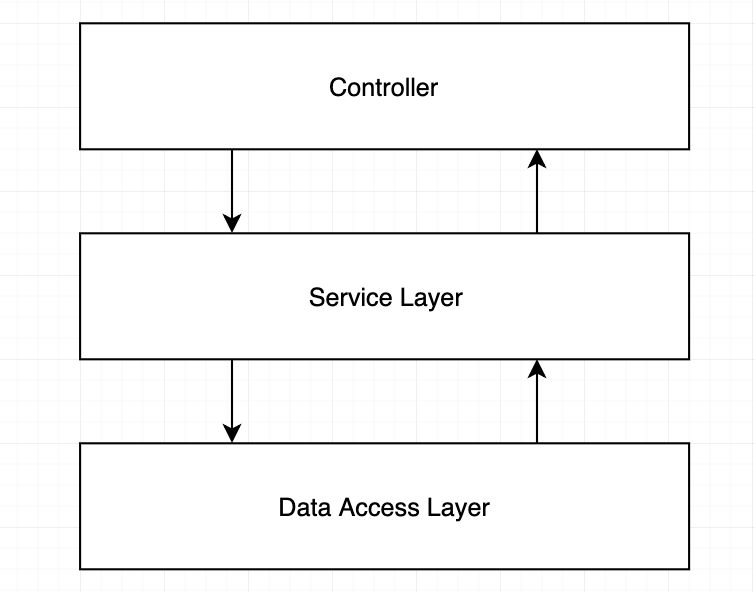
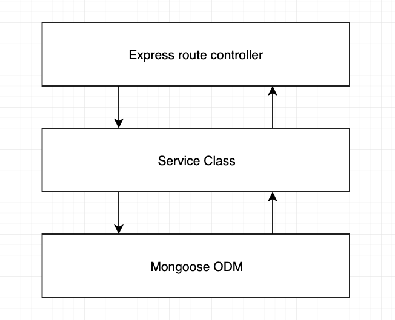

## Introduction

Express.js est un excellent framework pour la création d'une API REST en node.js, mais il ne vous donne aucune indication sur la manière d'organiser votre projet node.js.

Bien que cela puisse paraître stupide, c'est un problème réel.

Une organisation correcte de la structure de votre projet node.js évitera la duplication de code, améliorera la stabilité et, éventuellement, vous aidera à faire évoluer vos services si cela est effectué correctement.

Cet article est une recherche approfondie, issue de mes années d'expérience dans le traitement d'un projet node.js mal structuré, de mauvais schémas et d'innombrables heures de refactorisation de code et de déplacements.

## La structure du dossier 🏢

Voici la structure du projet node.js dont je parle.

J'utilise ceci dans chaque service d'API REST de node.js que je construis. Voyons en détail ce que chaque composant fait.

```text
src
│   app.js          # App entry point
└───api             # Express route controllers for all the endpoints of the app
└───config          # Environment variables and configuration related stuff
└───jobs            # Jobs definitions for agenda.js
└───loaders         # Split the startup process into modules
└───models          # Database models
└───services        # All the business logic is here
└───subscribers     # Event handlers for async task
└───types           # Type declaration files (d.ts) for Typescript
```

C'est plus qu'un moyen de commander des fichiers JavaScript...

## Architecture à 3 couches 🥪

L'idée est d'utiliser le **principe de séparation des préoccupations** pour éloigner la logique métier des routes de l'API node.js.



Parce qu'un jour, vous voudrez utiliser votre logique métier sur un outil CLI, ou ne pas aller très loin, dans une tâche récurrente.

Et faire un appel API du serveur node.js à lui-même, ce n'est pas une bonne idée...

 

### Ne placez pas votre logique métier dans les contrôleurs

Vous pouvez être tenté d'utiliser simplement les contrôleurs express.js pour stocker la logique métier de votre application, mais cela devient rapidement du code spaghetti. Dès que vous aurez besoin d'écrire des tests unitaires, vous finirez par avoir affaire à des mocks complexes pour des objets express.js tel que `req` ou `res`.

Il est difficile de distinguer quand une réponse doit être envoyée et quand continuer le traitement en "arrière-plan", disons après que la réponse a été envoyée au client.

Voici un exemple de ce qu'il ne faut pas faire.

```js
route.post('/', async (req, res, next) => {
  // This should be a middleware or should be handled by a library like Joi.
  const userDTO = req.body;
  const isUserValid = validators.user(userDTO)
  if(!isUserValid) {
    return res.status(400).end();
  }
  // Lot of business logic here...
  const userRecord = await UserModel.create(userDTO);
  delete userRecord.password;
  delete userRecord.salt;
  const companyRecord = await CompanyModel.create(userRecord);
  const companyDashboard = await CompanyDashboard.create(userRecord, companyRecord);
  ...whatever...
  // And here is the 'optimization' that mess up everything.
  // The response is sent to client...
  res.json({ user: userRecord, company: companyRecord });
  // But code execution continues :(
  const salaryRecord = await SalaryModel.create(userRecord, companyRecord);
  eventTracker.track('user_signup',userRecord,companyRecord,salaryRecord);
  intercom.createUser(userRecord);
  gaAnalytics.event('user_signup',userRecord);
  await EmailService.startSignupSequence(userRecord)
});
```

## Utilisez une couche de service pour votre logique métier 💼

Cette couche est l'endroit où votre logique métier doit vivre.

C'est juste un ensemble de classes, suivant les principes SOLID appliqués à node.js.

*Dans cette couche, il ne devrait exister aucune forme de "requête SQL", utilisez la couche d'accès aux données pour cela.*

- Éloignez votre code du routeur express.js
- Ne transmettez pas l'objet req ou res à la couche service
- Ne renvoyez aucun élément lié à la couche de transport HTTP, tel qu'un code d'état ou des en-têtes de la couche de service.

**Exemple**

```js
route.post('/', 
  validators.userSignup, // this middleware take care of validation
  async (req, res, next) => {
    // The actual responsability of the route layer.
    const userDTO = req.body;
    // Call to service layer.
    // Abstraction on how to access the data layer and the business logic.
    const { user, company } = await UserService.Signup(userDTO);
    // Return a response to client.
    return res.json({ user, company });
  });
```

Voici comment votre service travaillera dans les coulisses.

```js
import UserModel from '../models/user';
import CompanyModel from '../models/company';
export default class UserService() {
async Signup(user) {
  const userRecord = await UserModel.create(user);
  const companyRecord = await CompanyModel.create(userRecord); // needs userRecord to have the database id 
  const salaryRecord = await SalaryModel.create(userRecord, companyRecord); // depends on user and company to be created
  ...whatever
  await EmailService.startSignupSequence(userRecord)
  ...do more stuff
  return { user: userRecord, company: companyRecord };
}
}
```

## Utilisez aussi un calque Pub/Sub 🎙️️

Le modèle pub/sub va au-delà de l'architecture classique à 3 couches proposée ici, mais il est extrêmement utile.

Le simple endpoint de l'API node.js qui crée un utilisateur immédiatement, peut vouloir appeler des services tiers, peut-être à un service d'analyse, ou peut-être démarrer une séquence de courriels.

Tôt ou tard, cette simple opération "créer" fera plusieurs choses, et vous obtiendrez 1000 lignes de code, le tout en une seule fonction.

Cela viole le principe de la responsabilité unique.

Il est donc préférable de séparer les responsabilités dès le départ, afin que votre code reste maintenable.

```js
import UserModel from '../models/user';
import CompanyModel from '../models/company';
import SalaryModel from '../models/salary';
export default class UserService() {
  async Signup(user) {
    const userRecord = await UserModel.create(user);
    const companyRecord = await CompanyModel.create(user);
    const salaryRecord = await SalaryModel.create(user, salary);
    eventTracker.track(
      'user_signup',
      userRecord,
      companyRecord,
      salaryRecord
    );
    intercom.createUser(
      userRecord
    );
    gaAnalytics.event(
      'user_signup',
      userRecord
    );
    await EmailService.startSignupSequence(userRecord)
    ...more stuff
    return { user: userRecord, company: companyRecord };
  }
}
```

Un appel impératif à un service dépendant n'est pas la meilleure façon de le faire.

Une meilleure approche est d'émettre un événement, c'est-à-dire "un utilisateur s'est inscrit avec cet email".

Et vous avez terminé, c'est maintenant la responsabilité des listeners de faire leur travail.

```js
import UserModel from '../models/user';
import CompanyModel from '../models/company';
import SalaryModel from '../models/salary';
export default class UserService() {
  async Signup(user) {
    const userRecord = await this.userModel.create(user);
    const companyRecord = await this.companyModel.create(user);
    this.eventEmitter.emit('user_signup', { user: userRecord, company: companyRecord })
    return userRecord
  }
}
```

Vous pouvez maintenant scinder les gestionnaires d'événements/listeners en plusieurs fichiers.

```js
eventEmitter.on('user_signup', ({ user, company }) => {
  eventTracker.track(
    'user_signup',
    user,
    company,
  );
  intercom.createUser(
    user
  );
  gaAnalytics.event(
    'user_signup',
    user
  );
})
```

```js
eventEmitter.on('user_signup', async ({ user, company }) => {
  const salaryRecord = await SalaryModel.create(user, company);
})
```

```js
eventEmitter.on('user_signup', async ({ user, company }) => {
  await EmailService.startSignupSequence(user)
})
```

Vous pouvez mettre les instructions en attente dans un bloc `try-catch` ou vous pouvez simplement le laisser échouer et gérer le  'unhandledPromise' `process.on('unhandledRejection',cb)`

## Injection de dépendances 💉

`Dependency Injection` (D.I.) ou `inversion of control` (IoC) est un modèle commun qui aidera l'organisation de votre code, en "injectant" ou en passant par le constructeur les dépendances de votre classe ou fonction.

De cette façon, vous aurez la possibilité d'injecter une "dépendance compatible" lorsque, par exemple, vous écrirez les tests unitaires pour le service, ou lorsque le service sera utilisé dans un autre contexte.

_Code sans D.I._

```js
import UserModel from '../models/user';
import CompanyModel from '../models/company';
import SalaryModel from '../models/salary';  
class UserService {
  constructor(){}
  Sigup(){
    // Caling UserMode, CompanyModel, etc
    ...
  }
}
```

_Code avec injection manuelle de dépendance_

```js
export default class UserService {
  constructor(userModel, companyModel, salaryModel){
    this.userModel = userModel;
    this.companyModel = companyModel;
    this.salaryModel = salaryModel;
  }
  getMyUser(userId){
    // models available throug 'this'
    const user = this.userModel.findById(userId);
    return user;
  }
}
```

Vous pouvez maintenant injecter des dépendances personnalisées.

```js
import UserService from '../services/user';
import UserModel from '../models/user';
import CompanyModel from '../models/company';
const salaryModelMock = {
  calculateNetSalary(){
    return 42;
  }
}
const userServiceInstance = new UserService(userModel, companyModel, salaryModelMock);
const user = await userServiceInstance.getMyUser('12346');
```

Le nombre de dépendances qu'un service peut avoir est infini, et refactoriser chaque instanciation de celui-ci lorsque vous en ajoutez un nouveau est une tâche ennuyeuse et sujette aux  erreurs.

C'est pourquoi des frameworks d'injection de dépendance ont été créés.

L'idée est de déclarer vos dépendances dans la classe, et quand vous avez besoin d'une instance de cette classe, vous appelez simplement le `Service Locator`.

Voyons un exemple utilisant [`typedi`, une bibliothèque npm](https://www.npmjs.com/package/typedi) qui apporte l'injection de dépendances à node.js

Pour en savoir plus sur l'utilisation de `typedi`, consultez la [documentation officielle](https://github.com/typestack/typedi)

AVERTISSEMENT exemple en typescript

```typescript
import { Service } from 'typedi';
@Service()
export default class UserService {
  constructor(
    private userModel,
    private companyModel, 
    private salaryModel
  ){}
  getMyUser(userId){
    const user = this.userModel.findById(userId);
    return user;
  }
}
```

> services/user.ts
Maintenant _typedi_ s'occupera de résoudre toute dépendance dont le `UserService` a besoin.

```js
import { Container } from 'typedi';
import UserService from '../services/user';
const userServiceInstance = Container.get(UserService);
const user = await userServiceInstance.getMyUser('12346');
```

_L'abus d'appels de localisateur de service est un anti-pattern_

Utilisation de l'injection de dépendance avec Express.js dans Node.js

L'utilisation de D.I. dans express.js est la dernière pièce du puzzle de l'architecture de ce projet node.js.

**Couche de routage**

```js
route.post('/', 
  async (req, res, next) => {
    const userDTO = req.body;
    const userServiceInstance = Container.get(UserService) // Service locator
    const { user, company } = userServiceInstance.Signup(userDTO);
    return res.json({ user, company });
  });
```

Génial, le projet à l'air génial !
C'est tellement organisé que j'ai envie de coder quelque chose en ce moment.

## Un exemple de test unitaire 🕵🏻

En utilisant l'injection de dépendance et ces modèles d'organisation, le test unitaire devient vraiment simple.

Vous n'avez pas besoin de simuler des objets req/res ou de require(...)

**Exemple: Test unitaire pour la méthode d'inscription de l'utilisateur**

> tests/unit/services/user.js
```js
import UserService from '../../../src/services/user';
describe('User service unit tests', () => {
  describe('Signup', () => {
    test('Should create user record and emit user_signup event', async () => {
      const eventEmitterService = {
        emit: jest.fn(),
      };
      const userModel = {
        create: (user) => {
          return {
            ...user,
            _id: 'mock-user-id'
          }
        },
      };
      const companyModel = {
        create: (user) => {
          return {
            owner: user._id,
            companyTaxId: '12345',
          }
        },
      };
      const userInput= {
        fullname: 'User Unit Test',
        email: 'test@example.com',
      };
      const userService = new UserService(userModel, companyModel, eventEmitterService);
      const userRecord = await userService.SignUp(teamId.toHexString(), userInput);
      expect(userRecord).toBeDefined();
      expect(userRecord._id).toBeDefined();
      expect(eventEmitterService.emit).toBeCalled();
    });
  })
})
```

## Cron Jobs et tâches récurrentes ⚡

Ainsi, maintenant que la logique métier est encapsulée dans la couche service, il est plus facile de l'utiliser depuis un job Cron.

Vous ne devriez jamais compter sur `setTimeout` ou une autre façon primitive de retarder l'exécution du code, mais sur un framework qui persiste vos jobs, et l'exécution de ceux-ci, dans une base de données.

De cette façon, vous aurez le contrôle sur les jobs échoués, et la rétroaction de ceux qui réussissent.

## Configurations et secrets 🤫

Suivant les concepts éprouvés de [Twelve-Factor App](https://12factor.net/) pour node.js, la meilleure approche pour stocker les clés API et les chaînes de connexions aux base de données, c'est en utilisant **dotenv**.

Mettez un fichier `.env`, qui ne doit jamais être validé _(mais qui doit exister avec des valeurs par défaut dans votre référentiel)_ puis, le paquet npm `dotenv` charge le fichier `.env` et insert les variables dans l'objet `process.env` de node.js.

Cela pourrait suffire, mais j'aimerais ajouter une étape supplémentaire.
Avoir un fichier `config/index.ts` où le paquet npm `dotenv` et charge le fichier `.env` et puis j'utilise un objet pour stocker les variables, dons nous avons une structure et un code d'autocomplétion.

> config/index.js
```js
const dotenv = require('dotenv');
// config() will read your .env file, parse the contents, assign it to process.env.
dotenv.config();
export default {
  port: process.env.PORT,
  databaseURL: process.env.DATABASE_URI,
  paypal: {
    publicKey: process.env.PAYPAL_PUBLIC_KEY,
    secretKey: process.env.PAYPAL_SECRET_KEY,
  },
  paypal: {
    publicKey: process.env.PAYPAL_PUBLIC_KEY,
    secretKey: process.env.PAYPAL_SECRET_KEY,
  },
  mailchimp: {
    apiKey: process.env.MAILCHIMP_API_KEY,
    sender: process.env.MAILCHIMP_SENDER,
  }
}
```

De cette façon, vous évitez d'inonder votre code avec les instructions `process.env.MY_RANDOM_VAR`, et en ayant l'autocomplétion vous n'avez pas besoin de savoir comment nommer la variable d'environnement.

## Loaders 🏗️

J'ai pris ce modèle du [microframework de W3Tech](https://www.npmjs.com/package/microframework-w3tec) mais sans dépendre de leur paquet.

L'idée est de diviser le processus de démarrage de votre service node.js en modules testables.

Voyons une initialisation d'application express.js classique

```js
const mongoose = require('mongoose');
const express = require('express');
const bodyParser = require('body-parser');
const session = require('express-session');
const cors = require('cors');
const errorhandler = require('errorhandler');
const app = express();
app.get('/status', (req, res) => { res.status(200).end(); });
app.head('/status', (req, res) => { res.status(200).end(); });
app.use(cors());
app.use(require('morgan')('dev'));
app.use(bodyParser.urlencoded({ extended: false }));
app.use(bodyParser.json(setupForStripeWebhooks));
app.use(require('method-override')());
app.use(express.static(__dirname + '/public'));
app.use(session({ secret: process.env.SECRET, cookie: { maxAge: 60000 }, resave: false, saveUninitialized: false }));
mongoose.connect(process.env.DATABASE_URL, { useNewUrlParser: true });
require('./config/passport');
require('./models/user');
require('./models/company');
app.use(require('./routes'));
app.use((req, res, next) => {
  var err = new Error('Not Found');
  err.status = 404;
  next(err);
});
app.use((err, req, res) => {
  res.status(err.status || 500);
  res.json({'errors': {
    message: err.message,
    error: {}
  }});
});
... more stuff 
... maybe start up Redis
... maybe add more middlewares
async function startServer() {    
  app.listen(process.env.PORT, err => {
    if (err) {
      console.log(err);
      return;
    }
    console.log(`Your server is ready !`);
  });
}
// Run the async function to start our server
startServer();
```

Comme vous le voyez, cette partie de votre application peut être un vrai gâchis.

Voici une façon efficace d'y faire face.

```js
const loaders = require('./loaders');
const express = require('express');
async function startServer() {
  const app = express();
  await loaders.init({ expressApp: app });
  app.listen(process.env.PORT, err => {
    if (err) {
      console.log(err);
      return;
    }
    console.log(`Your server is ready !`);
  });
}
startServer();
```

Maintenant, les chargeurs ne sont plus que de minuscules fichiers avec un but concis

> loders/index.js
```js
import expressLoader from './express';
import mongooseLoader from './mongoose';
export default async ({ expressApp }) => {
  const mongoConnection = await mongooseLoader();
  console.log('MongoDB Intialized');
  await expressLoader({ app: expressApp });
  console.log('Express Intialized');
  // ... more loaders can be here
  // ... Initialize agenda
  // ... or Redis, or whatever you want}
```
Le loader express
> loaders/express.js
```js
import * as express from 'express';
import * as bodyParser from 'body-parser';
import * as cors from 'cors';
export default async ({ app }: { app: express.Application }) => {
  app.get('/status', (req, res) => { res.status(200).end(); });
  app.head('/status', (req, res) => { res.status(200).end(); });
  app.enable('trust proxy');
  app.use(cors());
  app.use(require('morgan')('dev'));
  app.use(bodyParser.urlencoded({ extended: false }));
  // ...More middlewares
  // Return the express app
  return app;
})
```
Le loader mongo
> loaders/mongoose.js
```js
import * as mongoose from 'mongoose'
export default async (): Promise<any> => {
  const connection = await mongoose.connect(process.env.DATABASE_URL, { useNewUrlParser: true });
  return connection.connection.db;
}
```## Conclusion
Nous plongeons en profondeur dans la structure d'un projet node.js testé en production, voici quelques conseils résumés:
- Utiliser une architecture à 3 couches.
- Ne mettez pas votre logique métier dans les contrôleurs express.js
- Ayez l'injection de dépendance pour votre tranquillité d'esprit.
- Ne divulguez jamais vos mots de passe, secrets et clés API, utilisez un gestionnaire de configuration.
- Divisez vos configurations de serveur node.js en petits modules qui peuvent être chargés indépendamment.
