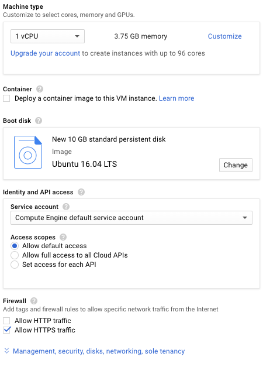
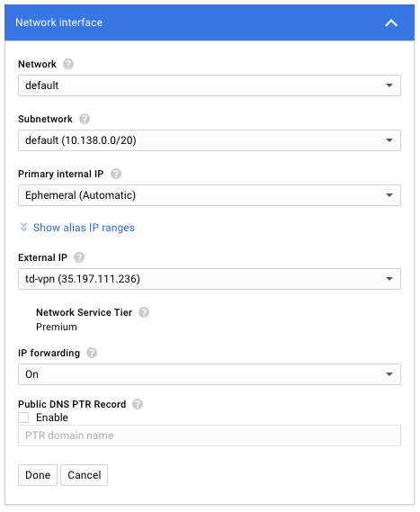

J'ai récemment commencé à utiliser OpenVPN et à profiter des différentes options qu'il propose, notamment le masquage du trafic VPN sous TCP:443 (autrement appelé HTTPS). Personnellement, j'aime utiliser GCE pour héberger mes VPN, car je profite de la puissance et de la personnalisation que cela procure.

Cependant, il n'y avait absolument aucun tutoriel sur la configuration d'OpenVPN sur GCE. Il existe 10 étapes dans ce didacticiel, mais chaque étape peut exécuter plusieurs lignes de code.

Si vous essayez simplement d'ajouter plus de clients, passer aux étapes 4, 9 et 10.

## 1. Création de l'instance

Nous voulons utiliser une instance `n1-standard-1` pour sa durabilité et son coût. Dirigez-vous vers le moteur de calcul et cliquez sur "CREATE INSTANCE".



Configurez-le avec les options affichées, mais n'appuyez pas encore sur "Créer"

Si vous ne voyez pas l'image, nous utilisons une instance `n1-standard-1` (1 vCPU, 3,75 Go de mémoire) avec Ubuntu 16.04 LTS installé (vous pouvez choisir un espace de stockage, mais 10 Go suffisent). Puisque notre VPN utilisera TCP: 443, nous devons autoriser le trafic HTTPS maintenant ou plus tard. Vous pouvez donc également le faire immédiatement.

Appuyez sur le bouton "Gestion, sécurité, disques, réseau, ..." pour ouvrir les options avancées. Cliquez sur l'onglet Réseau et cliquez sur le bouton d'édition en regard de l'interface réseau sélectionnée.

Cliquez sur le menu déroulant "Adresse IP externe" et sélectionnez "Créer une adresse IP". Entrez un nom, puis appuyez sur "Réserver". Cette opération associera une adresse IP statique à votre instance, ce qui est probablement ce que vous voulez, sauf si vous souhaitez régénérer les fichiers de configuration de quelque temps. En ce qui concerne les frais, Google ne facture pas les adresses IP statiques pendant leur utilisation. La machine `n1-standard-1` ne devrait pas vous coûter plus de 30 $ par mois. Certes, cela coûte un peu plus cher que la plupart des services VPN, mais la plupart des services VPN ne vous donnent pas un contrôle total :)



Vos interfaces réseau doivent ressembler à l'image. **Veillez à activer le transfert IP**, car cela ne peut plus être modifié après la création de l'instance.

En règle générale, vous souhaiterez probablement garder votre adresse IP externe secrète. Cela ne me dérange pas de rendre celui-ci public, car cette instance n'existera pas lorsque vous lirez ce tutoriel, et l'adresse IP appartiendra probablement à quelqu'un d'autre.

Appuyez sur "Terminé" et "Créer". Une fois l'instance prête (un bouton "SSH" noir apparaîtra), cliquez ou double-cliquez sur le bonton "SSH" pour ouvrir une fenêtre SSH. Le reste de la configuration se fera sur cette machine, que nous appellerons le "server".

## 2. Installation OpenVPN et EasyRSA

OpenVPN est (évidemment) le serveur VPN que nous utilisons, et EasyRSA est un paquet qui nous permettra de configurer une autorité de certification interne à utiliser.

Bien que ce ne soit généralement pas le cas, pour cette configuration, il est souvent nécessaire de lancer une mise à jour d'apt pour pouvoir installer un ou les deux packages. Les deux d'entre eux sont dans les dépôts par défaut d'Ubuntu.

```bash
sudo apt-get update
sudo apt-get install openvpn easy-rsa
```

Temps de configurer.

## 3. Mise en place du CA

Comme OpenVPN utilise TLS/SSL, il a besoin de certificats pour chiffrer le trafic. Pour cela, nous devrons émettre nos propres certificats de confiance, ce que nous pouvons faire à l'aide de la CA que nous sommes sur le point de configurer.

Commençons par copier le `easy-rsa` de modèles du paquet `easy-rsa`.

```bash
make-cadir ~/openvpn-ca
cd ~/openvpn-ca
```

Il y a des valeurs que nous pouvons vouloir éditer, alors allons-y et `nano vars`. Si vous voulez utiliser vim, continuez, mais puisque j'essaie de garder mes tutoriels aussi simples que possible, j'utilise nano.

> À partir de ce moment, s'il y a une partie d'une commande qui dépend d'une valeur que vous choisissez, elle sera en gras. Tout le code qui n'est pas généré par un utilisateur sera en italique.
Faites défiler vers le bas du fichier (ce n'est pas trop long) et vous devriez trouver ce qui suit:

<div class="language-text extra-class">
<pre class="language-text code">
export KEY_COUNTRY="<b>US</b>"
export KEY_PROVINCE="<b>CA</b>"
export KEY_CITY="<b>SanFrancisco</b>"
export KEY_ORG="<b>Fort-Funston</b>"
export KEY_EMAIL="<b>me@myhost.mydomain</b>"
export KEY_OU="<b>MyOrganizationalUnit</b>"
</pre>
</div>

Éditez autant d’entre eux (ou aucun d’eux) que vous le souhaitez. Juste en dessous de ces valeurs devrait être `export KEY_NAME="EasyRSA"`. Pour simplifier notre configuration, nous allons modifier cette ligne comme suit:

<div class="language-text extra-class">
<pre class="language-text code">
export KEY_NAME="<b>server</b>"
</pre>
</div>

Enregistrez et fermez le fichier (ctrl + x, y, entrez). Les variables que nous venons de modifier seront utilisées pour le processus de signature de notre autorité de certification. Toujours dans le `openvpn-ca`, exécutez la commande suivante:

```bash
source vars
```

Si vous avez bien fait, le re <code>NOTE: If you run ./clean-all, I will be doing a rm -rf on /home/<b>username</b>/openvpn-ca/keys</code>. C'est ce que nous voulons. Pour assurer un environnement de travail propre, nous allons lancer `./clean-all`.

Maintenant, construisons le CA

```bash
./build-ca
```

Toutes les variables que nous avons déjà définies doivent se renseigner elles-mêmes. Il suffit donc d’y accéder en appuyant plusieurs fois sur Entrée. À la fin, vous aurez une autorité de certification prête à commencer à signer.

Nous avons également besoin d'un certificat de serveur et d'une clé de cryptage pour garantir la sécurité de notre trafic.

Créons notre certificat de serveur et notre clé.

<div class="language-bash extra-class">
<pre class="language-bash code">
./build-key-server <b>server</b>
</pre>
</div>

Passer à nouveau les invites de commande. Nous n'entrerons pas un mot de passe, cette fois. Les deux dernières invites vous obligent à entrer `y` pour signer le certificat. Assurez-vous de ne pas les ignorer!

Comme indiqué précédemment, nous avons également besoin d’une clé de chiffrement. Pour les besoins de ce didacticiel, nous allons générer une clé Diffie-Hellman, qui a tendance à être plutôt forte. Bien sûr, une grande [force] entraîne une grande [inefficacité]. Par conséquent, quelle que soit votre système, la commande suivante prendra probablement quelques minutes.

```bash
./build-dh
```

Nous renforcerons cela avec une signature HMAC, afin de nous assurer que la vérification de l'intégrité TLS est plus sûre.

<div class="language-bash extra-class">
<pre class="language-bash code">
openvpn --genkey --secret keys/<b>tiv</b>.key
</pre>
</div>


## 4. Générer un certificat client

Naturellement, si vous allez utiliser une autorité de certification, votre client doit également disposer d'un certificat. Bien que vous puissiez le faire sur votre ordinateur client et que le serveur le signe, nous essayons de garder les choses simples et hébergées sur un seul ordinateur.

> Si vous avez plusieurs clients, vous pouvez suivre cette étape plusieurs fois. Assurez-vous simplement de rendre vos noms de client uniques.
Assurez-vous que vous êtes dans le `openvpn-ca` et que votre fichier vars est synchronisé.

```bash
cd ~/openvpn-ca
source vars
```

Maintenant, nous allons construire une clé client en tant que telle:

<div class="language-bash extra-class">
<pre class="language-bash code">
./build-key <b>client</b>
</pre>
</div>

Une fois de plus, tout doit être pré-rempli. Passez donc tous les éléments, sauf les deux dernières invites, qui vous demanderont de signer en entrant `y`.

## 5. Configurer le serveur OpenVPN

OpenVPN s’installe sous le répertoire `/etc/openvpn`. Pour que tout fonctionne, nous devons déplacer certains fichiers dans ce dossier.

<div class="language-bash extra-class">
<pre class="language-bash code">
cd ~/openvpn-ca/keys
sudo cp ca.crt server.crt server.key <b>tiv</b>.key dh2048.pem /etc/openvpn
</pre>
</div>

Par défaut, OpenVPN est fourni avec un exemple de configuration. Par souci de simplicité, nous simplifierons la décompression dans notre dossier de configuration.

```shell
gunzip -c /usr/share/doc/openvpn/examples/sample-config-files/server.conf.gz | sudo tee /etc/openvpn/server.conf
```

Ensuite, nous allons éditer le fichier de configuration:

```bash
sudo nano /etc/openvpn/server.conf
```

La première étape consiste à trouver la directive `tls-auth`. Il y aura un point-virgule (`;`) à côté de la directive, que nous supprimerons. En dessous, nous ajouterons une ligne.

<div class="language-text extra-class">
<pre class="language-text code">
tls-auth <b>tiv</b>.key 0 # This file is secret
key-direction 0
</pre>
</div>

Nous devons également chiffrer notre serveur, éditons donc les directives de chiffrement juste en dessous de cette section. Plus précisément, nous décommentons la ligne AES-128-CBC et ajouterons une directive `auth`.

```text
cipher AES-128-CBC
auth SHA256
```

Ensuite, les paramètres d'utilisateur et de groupe:

```text
user nobody
group nogroup
```

Facultativement, nous pourrions opter pour l'envoi de tout le trafic via le VPN. Pour cela, recherchez la directive `redirect-gateway` et décommentez-la.

```text
push "redirect-gateway def1 bypass-dhcp"
```

Juste en dessous, il devrait y avoir quelques lignes d’`dhcp-option`. Décommentez ceux-là aussi.

```text
push "dhcp-option DNS 208.67.222.222"
push "dhcp-option DNS 208.67.220.220"
```

Optionnellement, nous pouvons vouloir changer le port et le protocole sur lesquels OpenVPN fonctionne. La valeur par défaut est UDP: 1194, mais si votre réseau bloque les connexions VPN, ce sera probablement l'une des victimes. Le déguisement serait d'utiliser TCP: 443, qui est le port HTTPS.

```text
port 443
proto tcp
;proto udp
```

Si vous n'avez pas utilisé «serveur» comme nom de serveur, vos fichiers `crt` ont un nom différent. Mettez-les à jour en conséquence.

<div class="language-text extra-class">
<pre class="language-text code">
cert <b>server</b>.crt
key <b>server</b>.key
</pre>
</div>

Enregistrez et fermez le fichier.

## 6. Préparer Ubuntu

Bien que nous ayons déjà configuré le transfert IP, etc., nous devons apporter quelques modifications pour activer ces options.

```bash
sudo nano /etc/sysctl.conf
```

Recherchez la ligne suivante et supprimez le # (caractère de commentaire).

```text
net.ipv4.ip_forward=1
```

Sauver et fermer. Pour mettre à jour les paramètres de session, exécutez:

```bash
sudo sysctl -p
```

Ensuite, nous devons trouver et mettre à jour nos règles de pare-feu (UFW) pour masquer les clients. La première étape consiste à trouver l'interface sur laquelle nous fonctionnons:

```shell
ip route | grep default
```

L’interface que nous voulons est celle qui contient le mot "dev". Dans notre cas, cela ressemble à ceci:

<div class="language-text extra-class">
<pre class="language-text code">
default via 10.138.0.1 dev <b>ens4</b>
</pre>
</div>

Donc, notre interface est `ens4`. Avec cela, nous mettrons à jour nos règles de pare-feu:

```bash
sudo nano /etc/ufw/before.rules
```

Au-dessus, là où il est indiqué `Don't delete these required lines...` ajoutez le code suivant:

<div class="language-text extra-class">
<pre class="language-text code">
# OPENVPN
# NAT Table
*nat
:POSTROUTING ACCEPT [0:0] 
# OpenVPN client traffic
-A POSTROUTING -s 10.8.0.0/8 -o <b>ens4</b> -j MASQUERADE
COMMIT
# OPENVPN
</pre>
</div>

Sauver et fermer. Ensuite, nous devons transférer les paquets.

```bash
sudo nano /etc/default/ufw
```

Recherchez la directive `DEFAULT_FORWARD_POLICY` et remplacez-la de `"DROP"` par `"ACCEPT"`.

```text
DEFAULT_FORWARD_POLICY="ACCEPT"
```

Sauver et fermer.

## 7. Lancer OpenVPN

Pour démarrer le serveur, exécutez ce qui suit:

<div class="language-bash extra-class">
<pre class="language-bash code">
sudo systemctl start openvpn@<b>server</b>
</pre>
</div>

Pour vérifier qu'il a bien démarré, lancez:

<div class="language-bash extra-class">
<pre class="language-bash code">
sudo systemctl status openvpn@<b>server</b>
</pre>
</div>

Si tout se passe bien, vous devriez voir une sortie incluant `Active: active (running)`. Vous devrez peut-être `q` sur `q` pour quitter le panneau d'informations. Si cela vous convient, liez le service à la séquence de démarrage.

<div class="language-bash extra-class">
<pre class="language-bash code">
sudo systemctl enable openvpn@<b>server</b>
</pre>
</div>

## 8. Configuration d'une structure de configuration client

Pour faciliter la configuration des configurations client, nous allons d’abord créer une structure. Pour commencer, créez un dossier de configuration pour stocker les fichiers de configuration du client.

```bash
mkdir -p ~/clients/files
```

Les clés du client seront dans ces configurations, alors verrouillons les permissions sur le répertoire `files`.

```bash
chmod 700 ~/clients/files
```

Copiez l'exemple de configuration.

```bash
cp /usr/share/doc/openvpn/examples/sample-config-files/client.conf ~/clients/base.conf
```

Éditons le fichier:

```bash
nano ~/clients/base.conf
```

Trouvez la directive `remote`. Remplacez `my-server-1` par l'adresse IP externe publique attribuée à votre instance GCE. Si vous avez choisi un port autre que 1194, mettez-le à jour en conséquence.

<div class="language-text extra-class">
<pre class="language-text code">
remote <b>35.197.111.236 443</b>
</pre>
</div>

Mettez également à jour votre protocole.

<div class="language-text extra-class">
<pre class="language-text code">
proto <b>tcp</b>
</pre>
</div>

Décommentez l'utilisateur et le groupe:

```text
user nobody
group nogroup
```

Trouvez les directives `ca`, `cert` et `key`, commentez-les, car nos configurations les incluront automatiquement.

```text
# ca ca.crt
# cert client.crt
# key client.key
```

Utilisez les mêmes paramètres de chiffrement et d'authentification que précédemment:

```text
cipher AES-128-CBC
auth SHA256
```

Quelque part, nous devrons ajouter la `key-direction`. Assurez-vous d'utiliser 1, comme c'est le cas pour le client. 0 était pour le serveur.

```text
key-direction 1
```

Si votre configuration client actuelle est (ou sera) utilisée sur un périphérique Linux, ajoutez les éléments suivants:

```text
script-security 2
up /etc/openvpn/update-resolv-conf
down /etc/openvpn/update-resolv-conf
```

Notez que si vous les incluez dans un environnement non-Linux (Android et macOS inclus dans un non-Linux), vos clients peuvent se comporter de manière étrange.

Sauver et fermer. Ensuite, nous devons écrire un script pour générer nos configs client rapidement et facilement.

```bash
nano ~/clients/gen_config.sh
```

A l'intérieur, collez ce code:

<pre class="language-text code">
#!/bin/bash

# First argument: Client identifier

KEY_DIR=~/openvpn-ca/keys
OUTPUT_DIR=~/clients/files
BASE_CONFIG=~/clients/base.conf

cat ${BASE_CONFIG} \
    <(echo -e '&lt;ca&gt;') \
    ${KEY_DIR}/ca.crt \
    <(echo -e '&lt;/ca&gt;\n&lt;cert&gt;') \
    ${KEY_DIR}/${1}.crt \
    <(echo -e '&lt;/cert&gt;\n&lt;key&gt;') \
    ${KEY_DIR}/${1}.key \
    <(echo -e '&lt;/key&gt;\n&lt;tls-auth&gt;') \
    ${KEY_DIR}/<b>tiv</b>.key \
    <(echo -e '&lt;/tls-auth&gt;') \
    > ${OUTPUT_DIR}/${1}.ovpn
</pre>
<a href="./02/gen_config.sh" download>gen_config.sh</a>


Le `{1}` fait ici référence au premier argument, qui sera notre nom de client. Assurez-vous de mettre à jour **tiv**.key fonction du nom de votre clé HMAC.

Autoriser l'exécution de ce script:

```bash
chmod 700 ~/clients/gen_config.sh
```

## 9. Générer des configurations client

Le pas que vous attendiez tous est enfin arrivé. Nous allons générer nos configurations client.

<div class="language-bash extra-class">
<pre class="language-bash code">
cd ~/clients
./gen_config.sh <b>client</b>
</pre>
</div>

Vérifiez que cela a fonctionné en exécutant:

```bash
ls ~/clients/files
```

Si tel est le cas, il devrait maintenant y avoir un fichier <code><b>client</b>.ovpn</code> dans ce répertoire. Nous devons télécharger ce fichier et le transférer sur nos appareils. Pour ce faire, cliquez sur l'icône représentant une roue en haut à droite de la session SSH, puis sélectionnez «Télécharger le fichier».

Le chemin pleinement qualifié devrait ressembler à ceci:

<div class="language-text extra-class">
<pre class="language-text code">
/home/<b>username</b>/clients/files/<b>client</b>.ovpn
</pre>
</div>

## 10. Installation sur les clients
Pour Windows, téléchargez l'application client [OpenVPN](https://openvpn.net/index.php/open-source/downloads.html). Une fois installé, déplacez votre fichier <code><b>client</b>.ovpn</code> vers `C:\Program Files\OpenVPN\config`. Pour ouvrir OpenVPN, vous devez exécuter l'application en tant qu'administrateur. Une fois à l'intérieur, vous devriez voir et pouvoir vous connecter à votre VPN.

Pour macOS, la plupart des gens suggèrent d’utiliser [Tunnelblick](https://tunnelblick.net/) bien que tout autre client OpenVPN (même s’il soit sans danger) soit probablement bon aussi. Une fois installé, vous devriez pouvoir faire glisser n’importe .ovpn fichier `.ovpn` sur l’icône Tunnelblick de la barre de menus pour installer la configuration. Utilisez la barre de menus pour vous connecter ensuite au VPN. Si vous êtes interrogé sur le plugin `down-root.so`, prenez une décision! Je l'ai sauté parce que je suis capable de reconnecter ma connexion, mais c'est à vous de décider.

Sous Linux, installez le paquet `openvpn` en utilisant votre gestionnaire de paquets. Les utilisateurs de CentOS devront d'abord installer `epel-release` utilisant `yum`. Une fois installé, lancez `ls /etc/openvpn`. Si la sortie **ne** présente **pas** de fichier `update-resolve-conf`, vous devez modifier votre fichier `.ovpn` et supprimer les lignes suivantes (si vous les avez ajoutées):

```text
script-security 2
up /etc/openvpn/update-resolv-conf
down /etc/openvpn/update-resolv-conf
```

Si vous n'avez jamais ajouté ces lignes mais trouvé un fichier `update-resolv-conf`, ajoutez-les! Les utilisateurs de CentOS devront modifier le `group` dans le fichier `.ovpn` de `nogroup` à `nobody` pour se conformer aux normes du système d'exploitation.

Pour vous connecter, lancez `sudo openvpn — config client .ovpn`.

Pour iOS, installez l'application [OpenVPN Connect](https://itunes.apple.com/us/app/id590379981). Ensuite, ouvrez iTunes sur votre ordinateur et accédez à iPhone> Applications. Faites défiler jusqu'à la section «Partage de fichiers» et sélectionnez "OpenVPN". Faites glisser votre fichier `.ovpn` dans le panneau "OpenVPN Documents". Ouvrir l'application sur votre téléphone devrait maintenant afficher un message indiquant qu'un nouveau profil est prêt à être importé. Une fois importé, vous devriez pouvoir vous connecter au VPN.

Pour Android, installez l'application [OpenVPN Connect](https://play.google.com/store/apps/details?id=net.openvpn.openvpn). Ensuite, transférez votre fichier `.ovpn` n'importe où / de toute façon sur votre appareil (je viens d'utiliser Google Drive, mais cela peut ne pas être recommandé). Dans l'application, ouvrez le menu et cliquez sur "Importer". Accédez à votre fichier `.ovpn` , cliquez dessus, puis appuyez sur "IMPORT" en haut à droite. Une fois terminé, vous devriez pouvoir vous connecter au VPN.

## Test du VPN

Le moyen le plus simple de tester votre VPN serait de Google "quelle est mon adresse IP" avant et après la connexion. Votre adresse IP doit passer à l'adresse IP publique externe de votre instance GCE une fois que vous êtes connecté au VPN, puis à l'adresse IP de votre réseau une fois déconnectée du VPN.

Si tout s'est bien passé, c'est tout! Votre nouveau VPN est prêt à être utilisé.

## Crédits

Cet article est basé en grande partie sur [ce didacticiel de la communauté DigitalOcean](https://www.digitalocean.com/community/tutorials/how-to-set-up-an-openvpn-server-on-ubuntu-16-04). Bien que la configuration elle-même soit assez similaire, j’ai pensé écrire un article séparé, car il existe quelques éléments clés différents dans GCE et il est assez facile de se tromper si vous le faites pour la première fois (je parle par expérience).

<style lang="scss">
.content pre.code, 
.content pre[class*="language-"].code {
  /* font-size: 10pt; */
  font-size: 0.85em;
  font-family: source-code-pro, Menlo, Monaco, Consolas, "Courier New", monospace;
  color: #fff;

  b {
    color: yellow;
    /* text-decoration:underline; */
    /* background-color: green; */
  }
}
</style>
