Ici, nous allons passer en revue les commandes les plus importantes et les plus élémentaires que vous devez connaître pour créer, gérer et supprimer vos données sur votre base de données. Outre les commandes ici, j'utilise la syntaxe PostgreSQL. La plupart des bases de données relationnelles partagent les mêmes concepts.

En apprenant cela, vous pourrez créer et gérer votre base de données.

## Create table

Créons notre premier client:

```sql
CREATE TABLE customer (
	name TEXT,
	age INTEGER,
	email CHARACTER(255),
	address CHARACTER(400),
	zip_code CHARACTER(20)
);
```

Creusons par étapes:

1. Créez la table avec le nom `CREATE TABLE <NAME>` (qui pour nous est "customer").
2. Ajoutez les colonnes et le type de données approprié, comme l'`email CHARACTER(255)`

C'est simple, nous n'entrerons pas dans le type de données que ous pourrions utiliser, car il est long et peut changer de base de données à une autre base de données, l'idée est d'apprendre le principe.

## Insert

Nous passons maintenant à notre premier tableau et vous souhaitez maintenant à notre premier tableau et vous souhaitez maintenant ajouter des informations, sinon quel est le but, pour cela, vous lancerez cette commande:

```sql
INSERT INTO customer(name, age) VALUES('Felipe', 31);
```

Le code parle tout seul, nous voulons ajouter `<INSERT INTO>` notre table appelée "customer" pour la colonne portant le nom de clé "name" et "age" les `VALUES` suivant l'ordre, nommez "`Felipe`" et l'âge `31`.

## Alter Table

Il est normal que vous créiez votre base de données et que vous commenciez par la base, puis que vous commenciez à vous améliorer, et avec la commande, vous puissiez modifier la structure de la table. Mais bien sûr, ce n’est pas illimité si vous essayez de modifier des données existantes et susceptibles de provoquer un conflit, comme le passage d’un nombre entier à une chaîne .

```sql
ALTER TABLE customer ADD COLUMN height INTEGER;
```

Comme vous pouvez le constater, nous ajoutons une nouvelle `COLUMN` avec le nom `height` et le type `INTEGER`.
 
 Cette commande a beaucoup d'autres propriétés, vous pouvez donc consulter la documentation afin de voir toutes les autres variations.
 
 ## Update
 
 Nous avons ajouté des données à l'intérieur, mais considérons que vous avez commis une erreur ou, en fait, que vous souhaitez simplement mettre à jour, car c'est l'idée, pouvoir conserver des données et les manipuler.
 
 ```sql
UPDATE customer SET height = 0;
```

Ce sera utile non? Comme nous venons de modifier notre table et que nous ne voulons pas avoir de valeur vide pour une raison quelconque, nous faisons un `UPDATE` sur notre table client avec cette commande et `SET` la hauteur pour que tout le monde soit à `0`, comme une valeur par défaut.

Mais je ne veux pas faire cela à tout le monde, bien sûr, alors ce qui suit est plus spécifique.

```sql
UPDATE customer SET height = 60, age = 101 WHERE name = 'Felipe';
```

Nous avons fait la même chose qu'avant, à la différence que nous utilisons une nouvelle clause `WHERE` préciser ce que nous voulons changer, je parlerai plus en détail de cette question. Pour le moment, il vous suffit de comprendre que, si vous utilisez cette clause, je valide si "name" correspond au nom, et seulement s'il est vrai, je mets à jour les valeurs.

Et ce genre de validation est vraiment important, et parce que ceci est une autre façon de faire avec encore plus de "validations".

```sql
UPDATE customer SET height = 60, age = 101 WHERE (name = 'Felipe' AND zip_code = '2323LL') OR email = 'felipe@gmail.com';
```

Nous avons deux différences importantes où, voyons:

1. Notre clause `WHERE` a maintenant une autre clause appelée `AND` , et cela nous permet de "concaténer" deux valeurs que nous voulons vérifier, nous disons que les deux doivent correspondre pour que notre validation soit réussie . Il est important de noter qu’ils sont à l’intérieur de "()", il s’agit en quelque sorte de "retenir" en tant que valeur ou contrainte , nous vérifions en gros ce qui est à l’intérieur qui donnera le "résultat" qui sera vrai ou faux .
2. Le second est `OR` et correspond exactement à ce que suggère le "nom". Si notre clause `WHERE` ne convient pas, nous vérifions celle-ci.

## Upsert

En plus du nom qui a l'air bizarre, cette commande est très utile, car nous parlons de mise à jour, l'un des scénarios les plus courants consiste à vouloir mettre à jour quelque chose qui existe déjà, mais comment savez-vous qu'il existe déjà? Pour cela, vous pouvez généralement penser, commencez par vérifier s’il existe et si vous utilisez la commande update, non? Mais en réalité vous savez déjà ce que vous voulez, vous voulez que si cette valeur est déjà mise à jour.

PostgreSQL implémente cela il n'y a pas si longtemps, comme d'autres bases de données l'avaient déjà assez longtemps, voyons comment implémenter l'utilisation de Postgres.

Vous devez d’abord savoir que nous disposons de deux contraintes que nous pouvons utiliser pour "dire" ce que nous voulons faire si cette valeur existe déjà.

1. ON CONFLICT DO NOTHING
2. ON CONFLICT DO UPDATE

Par le nom, vous pouvez déjà imaginer ce qui se passe, lors de la mise à jour si vous trouvez un "conflit" avec un autre, ne faites rien.

Regardons comment utiliser `ON CONFLICT DO NOTHING` :

```sql
INSERT INTO customer (name, height) VALUES ('Felipe', 60) ON CONFLICT DO NOTHING; 
```
 
En gros, ce qui va se passer n’est rien, si la base de données trouve déjà une valeur, ne fait rien.

D'autre part pour `ON CONFLICT DO UPDATE` :

```sql
INSERT INTO customer (name, height) VALUES ('Felipe', 60) ON CONFLICT DO UPDATE;
```

Voici exactement ce que dit le nom, si vous trouvez un conflit, mettez-le à jour.

Il est simple d’utiliser ce scénario lorsque vous savez que vous souhaitez mettre à jour lorsque vous avez la même valeur. Rappelez-vous que l’implémentation change légèrement pour chaque base de données, mais qu’il est important de connaître le concept, il suffit de regarder sur Internet le nom de contrainte spécifique de votre base de données.

## Select

Maintenant que nous avons en principe commencé le début en suivant une méthode logique, comme créer votre base de données, mettre à jour, supprimer, la plupart des bases afin de configurer votre base de données, nous devons obtenir les données.

Très probablement, ce sera l'une des commandes les plus utilisées par vous, alors voyons-le.

```sql
SELECT * FROM customer;
```

La base est très simple, allons-y étape par étape:

1. `SELECT *` - Ce que vous faites est de dire "je veux" (`SELECT`) tout (`*`);
2. `FROM` - D'où je veux (`FROM`) c'est à partir du nom de la table (`customer).`

Ici, je reçois tout ce qui se trouve dans ma table client, soyons plus précis.

```sql
SELECT height, name FROM customer;
```

Maintenant que vous avez déjà compris comment vous créez, vous avez probablement compris que nous voulions des données spécifiques, à savoir les données des colonnes "height" et "name" de ma table customer .

Cette contrainte offre de nombreuses autres possibilités dont vous avez absolument besoin dans la documentation pour pouvoir visualiser toutes les autres variantes.

Un de plus, est pour la situation que vous ne voulez pas réellement sélectionner par le nom de la colonne, mais si elle correspond à la valeur, essayez ceci:

```sql
SELECT height, 'Felipe' FROM customer;
```

Comme je l'ai dit, nous rechercherons des données dans la colonne "hauteur" et toutes les valeurs correspondant à la chaîne "Felipe" en regard du nom de la colonne correspondante.

## Where

Cette contrainte est une autre que vous utiliserez encore plus avec la contrainte `SELECT` . Voyons comment nous utilisons, vous utiliserez ceci pour filtrer ce que vous voulez lors de la sélection de vos données.

```sql
SELECT height, name FROM customer WHERE height > 50;
```

Comme vous pouvez le constater, nous recherchons la taille du client et `WHERE` la "height" est supérieure à 50 .

Mais vous pouvez ajouter encore plus de contraintes (filtres).

```sql
SELECT height, name FROM customer WHERE height > 50 AND height < 80;
```

Nous avons ajouté ici une nouvelle contrainte `AND` qui fait exactement ce que son nom suggère, qui doit être plus haut que 50 ET inférieur à 80.

Une autre contrainte que nous pouvons utiliser est `OR`.

```sql
SELECT height, name FROM customer WHERE height > 50 OR name = 'Felipe';
```

Ici nous avons ajouté une autre contrainte `OR` cela signifie que si notre vérification "précédente" ne correspond pas comme son nom l'indique "OU", nous retournons sous forme de correspondance.

## Join

C'est certainement un sujet très important, non seulement parce que dans un entretien d'embauche, ils vous le demanderont certainement, mais aussi parce qu'il y a beaucoup de possibilités. Même si la première fois que vous essayez de comprendre, ça a l'air bizarre.

Pour cela nous avons 5 types:

- CROSS JOIN
- INNER JOIN
- LEFT JOIN
- RIGHT JOIN
- FULL JOIN

Je vais essayer d’expliquer de la manière la plus simple, mais je vous recommande d’essayer cela en direct. Lorsque vous le ferez, vous comprendrez mieux et vous verrez comme cela est facile.

Pour cela, nous avons besoin de quelques données pour pouvoir visualiser. Pour cela, je vais mettre une donnée à insérer, je reconnais que vous savez déjà comment créer une table. Nous aurons notre client et la table de contact .

Nos données clients:

```sql
INSERT INTO customer(name,age,email,address,zip_code) 
 VALUES 
 ('Paul',23,'paul@gmail.com','address from paul','2321LL'), 
 ('Felipe',32,'felipegarcia@gmail.com','address from felipe','3413MS'), 
 ('Teddy',90,'teddy@gmail.com','address from teddy','3423PO'), 
 ('Mark',17,'mark@gmail.com','address from mark','9423MA'), 
 ('David',35,'david@gmail.com','address from david','2341DA'), 
 ('Allen',56,'allen@gmail.com','address from allen','3423PO'), 
 ('James',56,'james@gmail.com','address from james','3423PO');
```

Et pour nos coordonnées:

```sql
 INSERT INTO contact(email,zip_code) 
 VALUES 
 ('teddy@gmail.com','3423PO'), 
 ('david@gmail.com','2341DA'), 
 ('james@gmail.com','3234PO'), 
 ('felipe@gmail.com',''); 
```

Vous devez juste exécuter ceci sur votre table déjà créée et l'insérer.

### Cross join

Je dirais que vous n'utiliserez pas trop celle-ci, car elle peut générer beaucoup de données. En gros, il joint ici les deux tables et génère une sortie avec toutes les données.

La façon dont cette contrainte fonctionne consiste à renvoyer des données de produit cartésiennes entre les deux tables. Cette commande multiplie la première table par la quantité de données de la seconde table. Elle renverra toujours la combinaison possible. Je crois que vous pouvez imaginer combien de données cela peut créer, non?!

Il est facile de voir la représentation de la façon dont cette requête sera traitée à partir de cette image, mais cela ne correspond pas seulement:

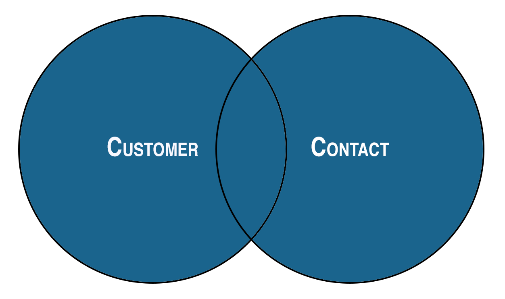

Allons à la commande:

```sql
SELECT * FROM customer CROSS JOIN contact;
```

Je n’ajouterai pas une impression de la sortie complète ici, car elle est trop grande, mais cette opération générera un total de 36 éléments/lignes, c’est-à-dire la multiplication entre le premier client de la table ayant 9 éléments multiplié par la table de contacts contenant 4

Mais une information précieuse ici est que, avec cela, nous allons générer une sortie qui contient toutes les lignes de la première table et toutes les lignes de la seconde:

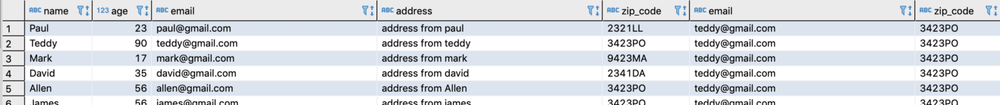

Et pourquoi répéter table? Eh bien, nous avons `SELECT *`, nous avons choisi d’obtenir toutes les données des deux, mais montrons-leur comment ne pas répéter ou, mieux, comment choisir la ligne de sortie que nous voulons.

Utilisez cette requête:

```sql
SELECT customer."name", customer.age, customer.address, contact.email, contact.zip_code FROM customer CROSS JOIN contact;
```

Une partie de la sortie:

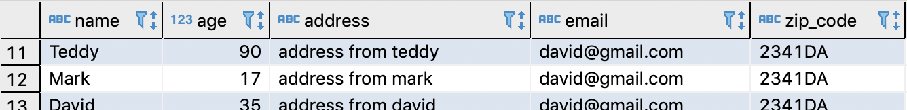

Si vous faites attention, ce que nous avons fait était de dire comment sera généré, en spécifiant la ligne que nous voulons et d'où `customer."name"` et `contact.zip_code` afin que la sortie suive cet ordre.

Je n'ai pas ajouté la "fin" de cette requête, ni même la précédente, mais parlons du concept de "jointure", nous cherchons fondamentalement une correspondance, mais pour cette contrainte, nous "obtenons tout" à partir d'une table et "Tout à partir de" deuxième table, mais dans le type CROSS si un élément ne correspond pas retournera quand même, mais s'il n'y a pas de correspondance, la valeur sera vide.

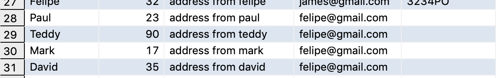

Parce que si vous faites attention à notre table de contact pour l'utilisateur "felipe@gmail.com ", il n'y a pas de correspondance avec personne à la table des clients , mais sera quand même retournée.

### Inner join

Maintenant que nous savons déjà quelque chose de base concernant ce que nous pouvons faire en matière de jointure , passons à la suivante, qui ressemble beaucoup à la jointure croisée, mais avec une simple différence qu'ici ne renverra que des correspondances.

C'est la représentation du type de jointure que nous faisons ici entre les tables, car vous ne voyez que le "centre" qui correspond à ce que nous aurons comme données.

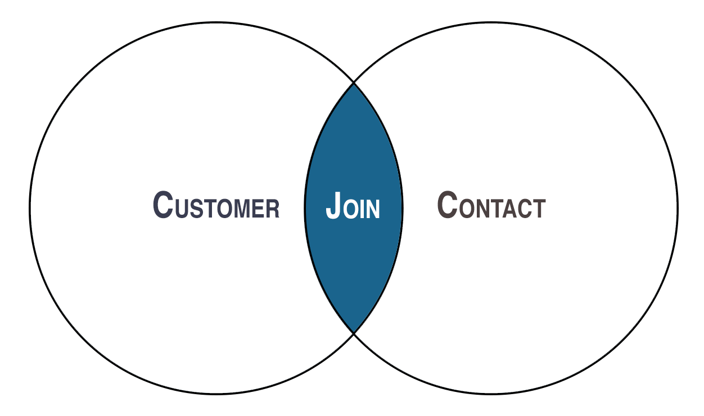

Ici, la syntaxe est un peu différente, nous devons ajouter une contrainte supplémentaire, celle qui recherchera la ligne "validateur ".

```sql
SELECT * FROM customer INNER JOIN contact ON customer.zip_code=contact.zip_code;
```

La principale différence que nous avons ici est que nous allons rechercher une correspondance en utilisant la table client et la table de contact , pour cela nous utiliserons la ligne "zip_code ".

C'est ce que vous aurez comme récupération de données.

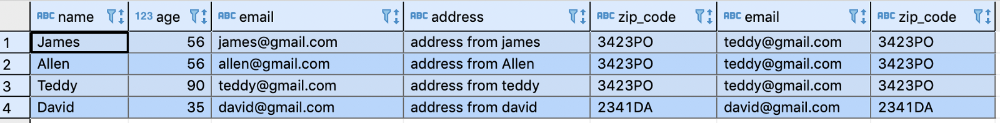

Il est facile de voir que lorsque nous retournons toutes les cellules, nous avons le code postal de la cellule du client et du contact , toutes les correspond.

Cette jointure est très utile pour récupérer des données que vous souhaitez faire correspondre à une valeur spécifique, différente de la relation ay.

### Left joint

Comme vous le savez peut-être, l'objectif principal est de faire correspondre les données et, si les données correspondent, nous renvoyons cette ligne.

Vous pouvez voir ici que nous avons au centre la partie jointure , c'est-à-dire le validateur, et la partie gauche qui signifie que si la jointure ne correspond pas, les données seront renvoyées mais avec la ligne pour les données qui ne correspond pas "vide".

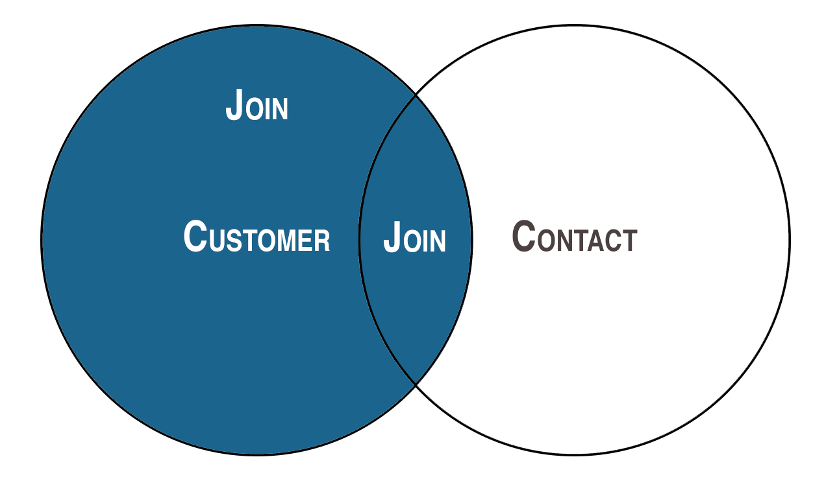

Mais ici maintenant, nous commençons à faire les choses différemment. Voyons en quoi consiste cette requête:

```sql
SELECT * FROM customer LEFT JOIN contact ON customer.zip_code=contact.zip_code;
```

La "transcription" de ce que nous demandons ici est la suivante: nous voulons toutes les données de `LEFT` qui, dans notre scénario, sont des clients , et nous voulons uniquement contacter la table celles qui correspondent à notre validation.

En faisant cela, vous devriez avoir ces données comme résultat de cette requête:

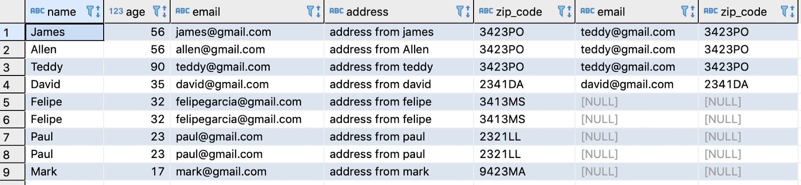

### Right join

Maintenant que nous avons déjà vu comment il est laissé joindre cela n’est pas différent, la seule différence est que nous voulons maintenant que le côté "droit" soit la table principale. Cela signifie que nous renverrons toutes les données de la table droite même si elles ne correspondent pas. Bien sûr ce qui n'a pas de correspondance est vide.

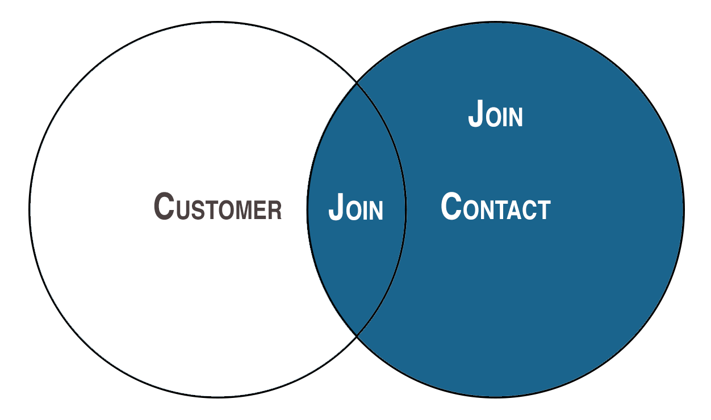

Question:

```sql
SELECT * FROM customer RIGHT JOIN contact ON customer.zip_code=contact.zip_code;
```

Mais il est important de ne pas se méprendre pour obtenir toutes les données de droite ou de gauche avec uniquement la quantité exacte de données dont nous disposons à cette table spécifique.

Ce que je veux dire par là, c’est que pour cette jointure, nous voulons "tout" du côté droit, c’est notre table de contact qui contient 4 éléments que nous avons ajoutés, et voici le résultat:

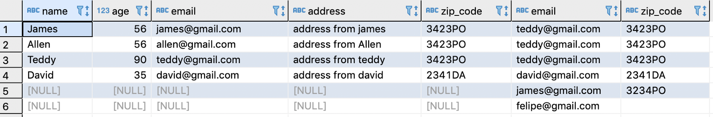

Nous avons 6 éléments et non 4, mais rappelez-vous, ce n'est pas une requête de "tout renvoyer d'un côté s'il y a correspondance ", c'est une requête qui renvoie tout d' un "côté" qui correspond, nous avons 2 correspondances pour le code postal 3423PO , c'est un match alors revenez.

### Full join

Maintenant le dernier, qui ressemble à la jointure croisée, la différence ici est que nous recherchons une **correspondance** et non un produit cartésien comme la jointure croisée.

Nous chercherons la jointure dans toute la zone bleue, en validant fondamentalement les deux côtés en fonction de notre contrainte de "validation", qui dans notre scénario est zip_code.


La jointure complète combine les deux tables, les données gauche et droite, et renvoie toutes les correspondances et toutes les correspondances , regardons la requête

```sql
SELECT * FROM customer FULL JOIN contact ON customer.zip_code=contact.zip_code;
```

Voici ce que nous aurons comme retour:

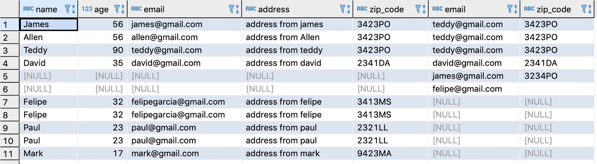

Ici, nous suivons le même principe que les "jointures" avant, c'est ce qui n'a pas de correspondance nous avons encore les données, mais "vide"

## Union

Cette commande est très utile, car il est question d’obtenir des données à partir de 2 tables, mais ne confondez bien sûr pas les deux.

Ce que fait Union, c’est que nous allons combiner les données des deux côtés, mais que nous ne renverrons que des données "uniques" entre les deux, si "identiques" ne renvoient pas les doublons, par exemple, c’est ce qui se produit avec join.

C'est la requête que nous utilisons:

```sql
SELECT customer.email, customer.zip_code FROM customer UNION SELECT contact.email, contact.zip_code FROM contact;
```

C'est ce que nous aurons comme retour:

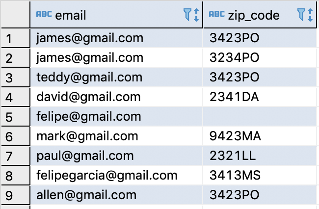

Comme vous pouvez le constater, nous spécifions les colonnes que nous voulons, ce qui est obligatoire, car nous devons préciser lesquelles sont "égales" afin qu'il puisse comparer et renvoyer des éléments uniques entre les deux.

Une chose importante concernant cette commande est qu’il opère de manière très efficace, cela signifie que l’ordre peut changer.

## Order

C’est une contrainte très utile pour organiser les données que vous demandez. Par conséquent, nous ne "filtrons" pas les données. En fait, il organise votre réponse en fonction de certains critères.

Simplement, ordonnons notre requête en fonction de l'âge de nos clients:

```sql
SELECT * FROM customer ORDER BY customer.age desc;
```

Et voici la réponse à laquelle vous devez vous attendre:

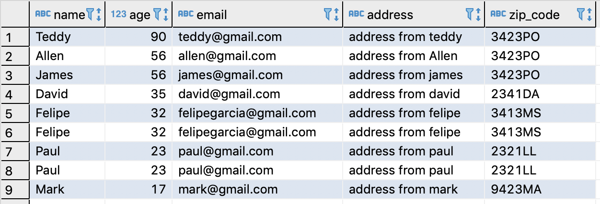

## Alias

Ceci n'est pas destiné à interroger quelque chose ou quelque chose comme ça, c'est juste un moyen de vous aider à organiser le nom d'une table, c'est simplement un surnom .

La syntaxe de base est la suivante:

```sql
SELECT A.name, A.zip_code FROM customer A;
```

Et vous devriez obtenir quelque chose comme ça:

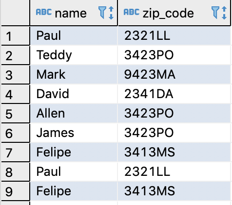

Séparons pour chaque partie, d'abord ce que nous avons fait, nous sélectionnons ce que nous voulons, mais si vous faites attention, nous ajoutons un caractère "**A**" avant le nom de la colonne , dans notre nom de scénario et code postal . Mais nous devons dire à notre code SQL ce que ce personnage ou "pseudo" signifie, n'est-ce pas?! Et nous le faisons après, lorsque nous disons `FROM customer A`, nous disons ici comment SQL devrait interpréter cette lettre, ce devrait être l'**alias** du client .

Vous pouvez également le faire lorsque vous avez plusieurs tables, par exemple:

```sql
SELECT A.zip_code, B.zip_code FROM customer A, contact B;
```

Vous pouvez voir que les deux sont "identiques", mais nous renommons pour avoir un autre **alias**.

Une autre chose que vous pouvez faire est de "changer" le nom de la table que vous retournez, par exemple:

```sql
SELECT name as "Person Age", A.zip_code FROM customer A;
```

Si vous voyez ici, j'ai utilisé deux formats d'alias, pour le premier, je n'utilise pas l'alias pour savoir quelle colonne est, mais ce que je veux, c'est que le retour de cette colonne soit appelé "Âge de la personne" et le second est l'alias façon de l'appel que nous avons déjà appris, c'est le résultat.

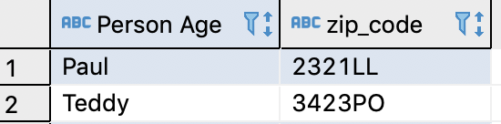

## Delete

Comme son nom l'indique, il s'agit d'une suppression, et je n'ai pas besoin de vous avertir qu'il s'agit d'une commande très "dangereuse", alors faites attention, je vais montrer 2 syntaxe de base:

```sql
DELETE FROM customer;
```

Vous avez peut-être remarqué que nous ne spécifions aucune donnée particulière. Nous allons donc tout supprimer, c'est simple, mais nous souhaitons supprimer une donnée spécifique. Pour cela, procédez comme suit:

```sql
DELETE FROM customer WHERE name = 'Felipe';
```

Ici, je dirais que la façon la plus sûre de faire, utilisez une personne spécifique.

## Drop table
Le sujet est sur la suppression, continuons avec ceci, la commande précédente est de supprimer les données d'une table / colonne, maintenant nous allons continuer, mais avec un autre type de suppression, celle qui supprime la table ou la supprime.

```sql
DROP TABLE customer;
```

C'est simple comme ça, mais vous devez être encore plus prudent que la commande delete . Ici, vous allez laisser tomber la table des trous et il n'y a aucun moyen de récupérer.

Une autre différence majeure est que cela ne devrait pas être utilisé dans votre "programme". Cette commande ne devrait être utilisée que par la commande de terminal lorsque vous savez ce qui doit être fait ou supprimé.
