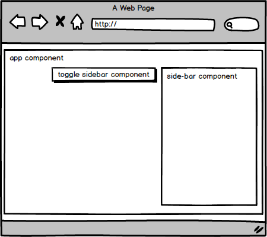
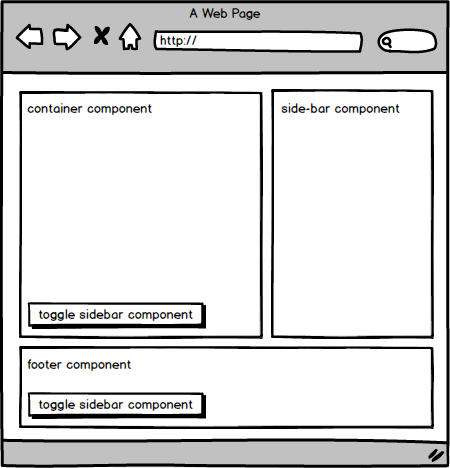

Bien que le titre de cet article soit un peu trompeur, car nous ne souhaitons pas vraiment communiquer directement entre les composants. Nos composants doivent être isolés et encapsulés. J'ai choisi ce titre parce que je pense que les développeurs aux prises avec ce problème le googleront de cette façon.

**Comment communiquer entre les composants?** C'est le sujet sur lequel j'ai vu beaucoup de nouveaux développeurs angular lutter pour communiquer entre les composants. Je vais vous montrer les trois approches les plus courantes, avec des exemples qui correspondent à différents cas d'utilisation.

Il y a aussi le "moyen de redux" que je pourrais couvrir dans un autre article à l'avenir.

---



Imaginez le cas d'utilisation de la barre latérale dans votre application. La barre latérale est ouverte ou fermée. Vous avez le composant side-bar et ensuite vous avez un composant (ou plusieurs composants) qui peuvent l'ouvrir / le fermer ou demander son état.

## Je décrirai trois manières de mettre en oeuvre ce comportement

1. Passer la référence d'un composant à un autre
2. Communication par le composant parent
3. Communication à travers le service

## 1. Passer la référence d'un composant à un autre

Cette solution doit être utilisée lorsque les composants ont une dépendance entre eux. Par exemple, dropdown et dropdown toggle. Ils ne peuvent généralement pas exister l'un sans l'autre.

> [Demo](https://stackblitz.com/edit/angular-communication-1-chjsqo)

Nous allons créer le composant `side-bar-toggle` qui aura le composant `side-bar` en entrée et en cliquant sur le bouton bascule nous ouvrirons / fermerons le composant `side-bar`.

Voici le code pertinent:

```html
<app-side-bar-toggle [sideBar]="sideBar"></app-side-bar-toggle>
<app-side-bar #sideBar></app-side-bar>
```

> app.component.html

```ts
@Component({
  selector: 'app-side-bar-toggle',
  templateUrl: './side-bar-toggle.component.html',
  styleUrls: ['./side-bar-toggle.component.css']
})
export class SideBarToggleComponent {

  @Input() sideBar: SideBarComponent;

  @HostListener('click')
  click() {
    this.sideBar.toggle();
  }
}
```

> side-bar-toggle.component.ts

```ts
@Component({
  selector: 'app-side-bar',
  templateUrl: './side-bar.component.html',
  styleUrls: ['./side-bar.component.css']
})
export class SideBarComponent {

  @HostBinding('class.is-open')
  isOpen = false;

  toggle() {
    this.isOpen = !this.isOpen;
  }
}
```

> side-bar.component.ts

---

## 2. Communication par le composant parent

Peut être utilisé lorsqu'il est facile de contrôler l'état partagé entre des composants via leur composant parent et que vous ne souhaitez pas créer de nouveau service ou créer du code standard, à cause d'une variable.

> [Demo](https://stackblitz.com/edit/angular-communication-2-7oahtg)

La mise en oeuvre de cette approche est presque la même que la précédente, mais le composant `side-bar-toggle` ne reçoit pas de composant `side-bar`. Au lieu de cela, le composant parent contient la propriété `sideBarIsOpened` qui est transmise au composant `side-bar`.

```html
<app-side-bar-toggle (toggle)="toggleSideBar()"></app-side-bar-toggle>
<app-side-bar [isOpen]="sideBarIsOpened"></app-side-bar>
```

> app.component.html

```ts
@Component({
  selector: 'my-app',
  templateUrl: './app.component.html',
  styleUrls: [ './app.component.css' ]
})
export class AppComponent {
  sideBarIsOpened = false;

  toggleSideBar(shouldOpen: boolean) {
    this.sideBarIsOpened = !this.sideBarIsOpened;
  }
}
```

> app.component.ts

```ts
@Component({
  selector: 'app-side-bar-toggle',
  templateUrl: './side-bar-toggle.component.html',
  styleUrls: ['./side-bar-toggle.component.css']
})
export class SideBarToggleComponent {

  @Output() toggle: EventEmitter<null> = new EventEmitter();

  @HostListener('click')
  click() {
    this.toggle.emit();
  }

}
```

> side-bar-toggle.component.ts

```ts
@Component({
  selector: 'app-side-bar',
  templateUrl: './side-bar.component.html',
  styleUrls: ['./side-bar.component.css']
})
export class SideBarComponent {

  @HostBinding('class.is-open') @Input()
  isOpen = false;

}
```

> side-bar.component.ts

---

## 3. Communication à travers le service

Enfin, cette option est utile et doit être utilisée lorsque vous avez un composant contrôlé ou que son état est demandé à plusieurs instances.



Nous avons maintenant plusieurs emplacements dans l'application qui devront accéder à notre composant `sibe-bar`. Voyons comment nous le faisons.

Nous allons maintenant créer `side-bar.service.ts` donc nous aurons:

- side-bar.service.ts
- side-bar.component.ts
- side-bar.component.html

Les services de la barre latérale auront une méthode et un événement à changer pour que chaque composant qui injectera ce service puisse être averti de l'ouverture ou de la bascule d'un panneau.

Dans cet exemple, aucun composant latéral ni composant latéral ne comporte de paramètres d'entrée, car ils communiquent via le service.

Maintenant le code:

```html
<app-side-bar-toggle></app-side-bar-toggle>
<app-side-bar></app-side-bar>
```

> app.component.html

```ts
@Component({
  selector: 'app-side-bar-toggle',
  templateUrl: './side-bar-toggle.component.html',
  styleUrls: ['./side-bar-toggle.component.css']
})
export class SideBarToggleComponent {

  constructor(
    private sideBarService: SideBarService
  ) { }

  @HostListener('click')
  click() {
    this.sideBarService.toggle();
  }
}
```

> side-bar-toggle.component.ts

```ts
@Component({
  selector: 'app-side-bar',
  templateUrl: './side-bar.component.html',
  styleUrls: ['./side-bar.component.css']
})
export class SideBarComponent {

  @HostBinding('class.is-open')
  isOpen = false;

  constructor(
    private sideBarService: SideBarService
  ) { }

  ngOnInit() {
    this.sideBarService.change.subscribe(isOpen => {
      this.isOpen = isOpen;
    });
  }
}
```

> side-bar.component.ts

```ts
@Injectable()
export class SideBarService {

  isOpen = false;

  @Output() change: EventEmitter<boolean> = new EventEmitter();

  toggle() {
    this.isOpen = !this.isOpen;
    this.change.emit(this.isOpen);
  }
}
```

> side-bar.service.ts
