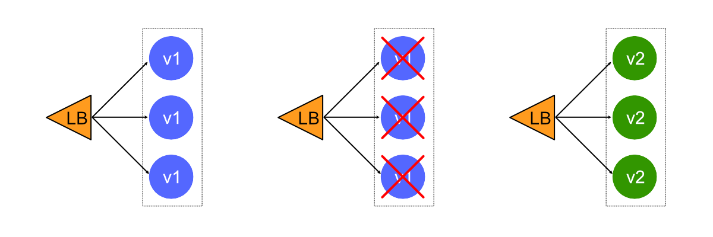
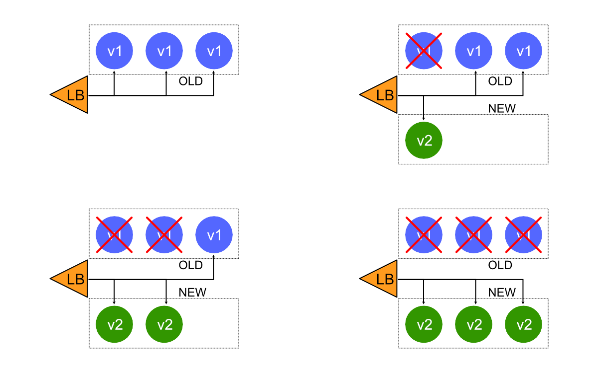
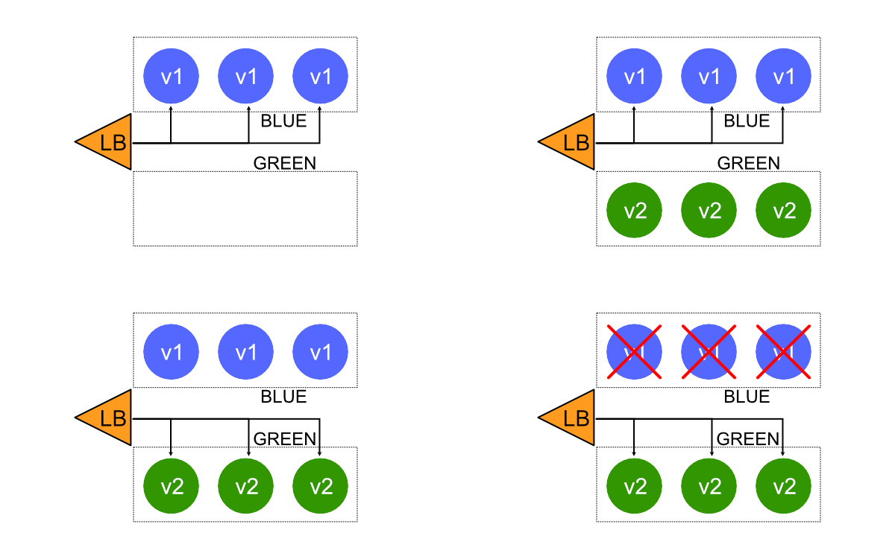
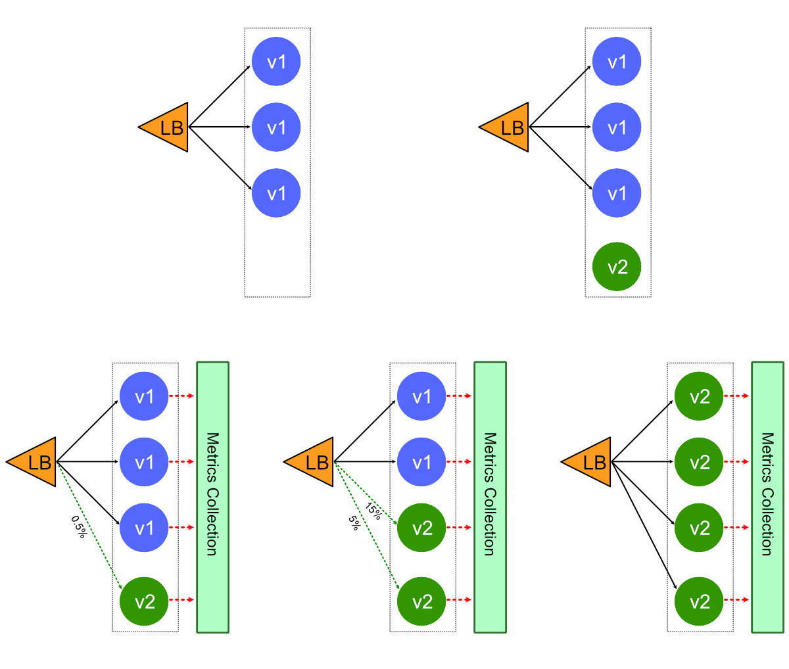
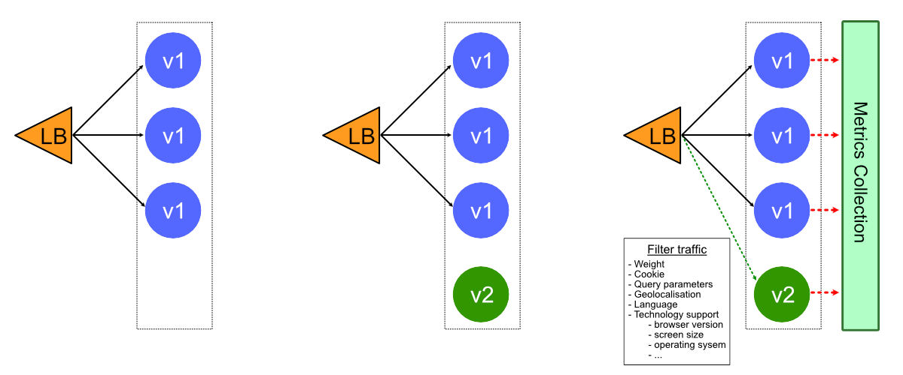

Dans Kubernetes, il existe plusieurs façons de publier une application. Il est donc nécessaire de choisir la bonne stratégie pour rendre votre infrastructure fiable lors de la mise à jour d'une application.

Le choix de la procédure de déploiement appropriée dépend des besoins. Nous avons énuméré ci-dessous certaines des stratégies possibles à adopter:

- Recreate
- RollingUpdate
- Blue/Green
- Canary
- A/B testing

Vous pouvez expérimenter chacune de ces stratégies avec Minikube, les manifestes et les étapes à suivre sont expliqués dans ce [github](https://github.com/ludovicwyffels/k8s-deployment-demo)

Examinons chaque stratégie et voyons quel type d'application vous conviendrez le mieux.

## Recreate - idéal pour l'environnement de développement

Un déploiement défini avec une stratégie de type **recreate** mettra fin à toutes les instances en cours d'exécution, puis les recréera avec la version la plus récente.



```yml
spec:
  replicas: 3
  strategy:
    type: Recreate
```

> Vous trouverez un exemple complet et les étapes de déploiement à l'adresse https://github.com/ludovicwyffels/k8s-deployment-demo/tree/master/recreate
Avantage
- État d'application entièrement renouvelé

Inconvénients
- Temps d'arrêt qui dépend à la fois de la durée d'arrêt et du démarrage de l'application

<a name="rollingupdate"></a>

## RollingUpdate - déploiement lent

Ce déploiement met à jour les pods de façon progressive. Un **ReplicaSet** secondaire est créé avec la nouvelle version de l'application, puis le nombre de répliques de l'ancienne version est réduit et la nouvelle version est augmentée jusqu'à ce que le nombre correct de répliques soit atteint.



```yml
spec:
  replicas: 3
  strategy:
    type: RollingUpdate
    rollingUpdate:
      maxSurge: 2        # how many pods we can add at a time
      maxUnavailable: 0  # maxUnavailable define how many pods can be unavailable during the rolling update
```
> Vous trouverez un exemple complet et les étapes de déploiement à l'adresse https://github.com/ludovicwyffels/k8s-deployment-demo/tree/master/ramped
Lors de la configuration avec la mise à l' échelle automatique du pod horizontal, il peut être pratique d'utiliser une valeur en pourcentage au lieu d'un nombre pour maxSurge et maxUnavailable .


- `maxSurge` permet d'indiquez combien de Pod il peut créer en plus du nombre de répliqua actuellement configurer
- `maxUnavailable` permet d’indiquer combien de Pod peuvent être "non disponible" pendant la mise à jour, toujours en fonction du nombre de répliqua configuré

Si vous déclenchez un déploiement alors qu'un déploiement existant est en cours, le déploiement mettra le déploiement en pause et passera à une nouvelle version en remplaçant le déploiement.

Avantages
- la version est lentement publiée sur toutes les instances
- pratique pour les applications avec état pouvant gérer le rééquilibrage des données

Inconvénients
- le déploiement/la restauration peut prendre du temps
- la prise en charge de plusieurs API est difficile
- aucun contrôle sur le trafic

## Blue/Green - mieux éviter les problèmes de versioning de l'API

Un déploiement blue/green diffère d'un déploiement parce que la version "green" de l'application est déployée en parallèle de la version "blue". Après avoir vérifié que la nouvelle version réponde aux exigences, nous mettons à jour l'objet Kubernetes Service qui joue le rôle d'équilibreur de charge pour envoyer du trafic vers la nouvelle version en remplaçant l'étiquette de version dans le champ `selector`



```yml
apiVersion: v1
kind: Service
metadata:
 name: my-app
 labels:
   app: my-app
spec:
 type: NodePort
 ports:
 - name: http
   port: 8080
   targetPort: 8080
 
 # Note here that we match both the app and the version.
 # When switching traffic, we update the label “version” with
 # the appropriate value, ie: v2.0.0
 selector:
   app: my-app
   version: v1.0.0
```
> Vous trouverez un exemple complet et les étapes de déploiement à l'adresse https://github.com/ludovicwyffels/k8s-deployment-demo/tree/master/blue-green
Avantages
- déploiement instantané
- éviter le problème de versioning, changer l'état du cluster en une fois

Inconvénients
- nécessite le double des ressources
- le bon test de toute la plate-forme doit être effectué avant la mise en production
- la gestion des applications avec état peut être difficile

<a name="canary"></a>

## Canary - laissez le consommateur faire le test

Le déploiement **Canary** consiste à router un sous-ensemble d'utilisateurs vers une nouvelle fonctionnalité. Dans Kubernetes, un déploiement canary peut être effectué en utilisant deux déploiements avec des étiquettes de pods communes. Une réplique de la nouvelle version est publiée à côté de l'ancienne version. Ensuite, après un certain temps et si aucune erreur n'est détectée, augmentez le nombre de répliques de la nouvelle version et supprimez l'ancien déploiement.

L'utilisation de cette technique **ReplicaSet** nécessite de faire tourner autant de pod que nécessaire pour obtenir le bon pourcentage de trafic. Cela dit, si vous voulez envoyer 1% du trafic vers la version B, vous devez avoir un pod fonctionnant avec la version B et 99 pods fonctionnant avec la version A. Cela peut être assez peu pratique à gérer donc si vous recherchez une meilleure répartition du trafic, regarder les équilibreurs de charge tels que [HAProxy](http://www.haproxy.org/) ou les mailles de service comme [Linkerd](https://linkerd.io/), qui offrent un meilleur contrôle du trafic.



Dans l'exemple suivant, nous utilisons deux ReplicaSets côte à côte, la version A avec trois répliques (75% du trafic), la version B avec un répliqua (25% du trafic).

Manifeste de déploiement tronqué version A:
```yml
spec:
  replicas: 3
```

Manifeste de déploiement tronqué version B, notez que ous ne démarrons qu'un seul répliqua de l'application:
```yml
spec:
  replicas: 1
```

> Vous trouverez un exemple complet et les étapes de déploiement à l'adresse https://github.com/ludovicwyffels/k8s-deployment-demo/tree/master/canary
Avantages
- version publiée pour un sous-ensemble d'utilisateurs
- pratique pour la surveillance du taux d'erreur et des performances
- rollback rapide

Inconvénients
- déploiement lent
- la répartition du trafic ajustée peut être coûteuse (99% A / 1% B = 99 pod A, 1 pod B)

La procédure utilisée ci-dessus est native de Kubernetes, nous ajustons le nombre de répliques gérées par un ReplicaSet pour distribuer le trafic entre les versions.

Si vous n'êtes pas sûr de l'impact que la sortie d'une nouvelle fonctionnalité pourrait avoir sur la stabilité de la plate-forme, une stratégie de sortie canari est suggérée.

<a name="abtesting"></a>

## A/B testing - idéal pour testes les fonctionnalités sur un sous-ensemble d'utilisateurs

Le test A/B est en fait une technique permettant de prendre des décisions d'affaires basées sur des statistiques, plutôt qu'une stratégie de déploiement. Cependant, il est apparenté et peut être mis en oeuvre à l'aide d'un déploiement canari, c'est pourquoi nous en parlerons brièvement ici.

En plus de répartir le trafic entre les versions en fonction du poids, vous pouvez cibler précisément un groupe donné d'utilisateurs en fonction de quelques paramètres (cookie, user agent, etc.). Cette technique est largement utilisée pour tester la conversion d'une fonctionnalité donnée et ne déployer que la version qui convient le plus.

[Istio](https://istio.io/), comme les autres maillages de service, fournis un moyen plus fin de subdiviser les instances de service avec un routage dynamique des requêtes basé sur des poids et/ou des en-têtes HTTP.



Vous trouverez ci-dessous un exemple d'installation de règles à l'aide d'Istio.

```yml
route:
- tags:
  version: v1.0.0
  weight: 90
- tags:
  version: v2.0.0
  weight: 10
```

Vous trouverez un exemple complet et les étapes de déploiement à l'adresse https://github.com/ludovicwyffels/k8s-deployment-demo/tree/master/ab-testing

D'autres outils comme [Linkerd](https://linkerd.io/), [Traefik](https://traefik.io/), [NGINX](https://www.nginx.com/), [HAProxy](http://www.haproxy.org/), vous permettent également de le faire.

Avantages
- nécessite un équilibreur de charge intelligent
- plusieurs versions en parallèle
- un contrôle total sur la répartition du trafic

Inconvénients
- les erreurs difficiles à dépanner pour une session donnée, le traçage distribué deviennent obligatoires
- pas simple, vous devez configurer des outils supplémentaires

<a name="summary"></a>

### En résumé

Il y a différentes façons de déployer une application, lors de la mise en production dans un **environnement de développement/staging**, un déploiement [big bang](#recreate---id%c3%a9al-pour-lenvironnement-de-d%c3%a9veloppement) ou [progressif](#rollingupdate---d%c3%a9ploiement-lent) est généralement un bon choix. Lorsqu'il s'agit de **production**, un déploiement [progressif](#rollingupdate---d%c3%a9ploiement-lent) ou en [blue/green](#bluegreen---mieux-%c3%a9viter-les-probl%c3%a8mes-de-versioning-de-lapi) est généralement un bon choix, mais un test approprié de la nouvelle plate-forme est nécessaire. Si vous n'êtes pas sûr de la stabilité de la plate-forme et de l'impact que pourrait avoir la sortie d'une nouvelle version de logiciel, alors une version [canari](#canary---laissez-le-consommateur-faire-le-test) devrait être la bonne solution. Ce faisant, vous laissez le consommateur tester l'application et son intégration à la plate-forme. Enfin, si votre entreprise a besoin de tester une nouvelle fonctionnalité parmi un groupe spécifique d'utilisateurs, par exemple, tous les utilisateurs accédant à l'application à l'aide d'un téléphone mobile sont envoyés à la version A, tous les utilisateurs accédant via un ordinateur passent à la version B. Vous pouvez alors utiliser la technique de [test A/B](#ab-testing---id%c3%a9al-pour-testes-les-fonctionnalit%c3%a9s-sur-un-sous-ensemble-dutilisateurs) qui en utilisant un réseau de services Kubernetes ou une configuration serveur personnalisée vous permet de déterminer où un utilisateur doit être dirigé en fonction de certains paramètres.
