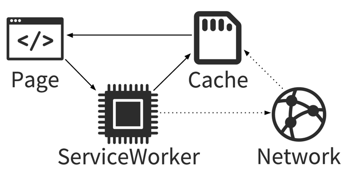

Dans le passé, vous avez peut-être utilisé des notifications dans votre programme en utilisant quelque chose comme PubNub ou pusher ou un autre service tiers.
Mais ce module, [web-push](https://github.com/web-push-libs/web-push), nous permet de le faire sans l'aide de l'un de ces services tiers.

Avez-vous déjà entendu parler de **service worker**? Si vous ne connaissez pas ce qu'est une progressive web apps, il y a peu de chance que le terme de service worker vous parle

## Définition d'un service worker

Les service workers jouent essentiellement le rôle de serveurs proxy placés entre une application web, et le navigateur ou le réseau (lorsque disponible.) Ils sont destinés (entre autres choses) à permettre la création d'expériences de navigation déconnectée efficaces, en interceptant les requêtes réseau et en effectuant des actions appropriées selon que le réseau est disponible et que des ressources mises à jour sont à disposition sur le serveur. Ils permettront aussi d'accéder aux APIs de notifications du serveur (push) et de synchronisation en arrière-plan.



Plus d'information sur son fonctionnement sur :
- un [guide pour débutant](https://medium.com/samsung-internet-dev/a-beginners-guide-to-service-workers-f76abf1960f6)
- la [documentation de mozilla](https://developer.mozilla.org/en-US/docs/Web/API/Service_Worker_API)

Le service worker fonctionne avec les dernières versions de Chrome et Firefox, je ne crois pas que Edge le support encore. Mais ce n'est pas grave puisque Edge va bientôt changer son moteur pour Chromium.

## Module `web-push`

Commençons un nouveau projet en installant les dépendances

```shell
npm init -y
npm i web-push express body-parser
```

Créons un fichier index.js

```js
const express = require("express");
const webpush = require("web-push");
const bodyParser = require("body-parser");
const path = require("path");
const app = express();
app.use(bodyParser.json());
```

Nous avons besoin de générer des clés, pour se faire:

```shell
./node_modules/.bin/web-push generate-vapid-keys
```

ou

```shell
npm install web-push -g
web-push generate-vapid-keys
```

Vous obtenez une paire de clés privées/public comme ceux-ci:

```text
=======================================
Public Key:
BCaNVf9IEdCkrBvkwk5P48lnc8LlbFlW1VlmEB3D3BjDll1jTIZ6wCMPDF_360Veqe_lhasd7PmhBUKrSGsEOpQ
Private Key:
CdYF_enPzI0y9n1bHdy2NQqmtdvaEhJkKpI6IpPHaAQ
=======================================
```

On va les utiliser tout de suite

```js 
/* index.js */
...
const publicVapidKey =
  "BCaNVf9IEdCkrBvkwk5P48lnc8LlbFlW1VlmEB3D3BjDll1jTIZ6wCMPDF_360Veqe_lhasd7PmhBUKrSGsEOpQ";
const privateVapidKey = "CdYF_enPzI0y9n1bHdy2NQqmtdvaEhJkKpI6IpPHaAQ";
webpush.setVapidDetails(
  "mailto:test@test.com",
  publicVapidKey,
  privateVapidKey
);
// Subscribe Route
app.post("/subscribe", (req, res) => {
  // Get pushSubscription object
  const subscription = req.body;
  // Send 201 - resource created
  res.status(201).json({});
  // Create payload
  const payload = JSON.stringify({ title: "Push Test" });
  // Pass object into sendNotification
  webpush
    .sendNotification(subscription, payload)
    .catch(err => console.error(err));
});
const port = 5000;
app.listen(port, () => console.log(`Server started on port ${port}`));
```

Il nous reste a configurer un dossier statique, en ajoutant la ligne suivante dans notre fichier `index.js`

```js
// Set static path
app.use(express.static(path.join(__dirname, "client")));
```

Redémarrer le serveur.

Créer le dossier `client`

```html
<!DOCTYPE html>
<html lang="en">

<head>
  <meta charset="UTF-8">
  <meta name="viewport" content="width=device-width, initial-scale=1.0">
  <meta http-equiv="X-UA-Compatible" content="ie=edge">
  <title>Push Notifications Using Node</title>
</head>

<body>
  <h1>Push Notifications Using Node</h1>

  <script src="client.js"></script>
</body>

</html>
```

```js
const publicVapidKey =
  "BCaNVf9IEdCkrBvkwk5P48lnc8LlbFlW1VlmEB3D3BjDll1jTIZ6wCMPDF_360Veqe_lhasd7PmhBUKrSGsEOpQ";
// Check for service worker
if ("serviceWorker" in navigator) {
  send().catch(err => console.error(err));
}
// Register Service Worker, Register Push, Send Push
async function send() {
  // Register Service Worker
  console.log("Registering service worker...");
  const register = await navigator.serviceWorker.register("/worker.js", {
    scope: "/"
  });
  console.log("Service Worker Registered...");
  // Register Push
  console.log("Registering Push...");
  const subscription = await register.pushManager.subscribe({
    userVisibleOnly: true,
    applicationServerKey: urlBase64ToUint8Array(publicVapidKey)
  });
  console.log("Push Registered...");
  // Send Push Notification
  console.log("Sending Push...");
  await fetch("/subscribe", {
    method: "POST",
    body: JSON.stringify(subscription),
    headers: {
      "content-type": "application/json"
    }
  });
  console.log("Push Sent...");
}
function urlBase64ToUint8Array(base64String) {
  const padding = "=".repeat((4 - base64String.length % 4) % 4);
  const base64 = (base64String + padding)
    .replace(/\-/g, "+")
    .replace(/_/g, "/");
  const rawData = window.atob(base64);
  const outputArray = new Uint8Array(rawData.length);
  for (let i = 0; i < rawData.length; ++i) {
    outputArray[i] = rawData.charCodeAt(i);
  }
  return outputArray;
}
```

Dans le service Worker, nous allons juste écouter les événements `push`

```js
console.log("Service Worker Loaded...");
self.addEventListener("push", e => {
  const data = e.data.json();
  console.log("Push Recieved...");
  self.registration.showNotification(data.title, {
    body: "Notified by my app :)",
    icon: "https://design.firefox.com/photon/images/product-identity-assets/firefox.png"
  });
});
```

Ouvrer dans votre navigateur Chrome/Firefox, l'URL [localhost:5000](http://localhost:5000), vous devriez avoir une popup vous demandant d'autoriser ou non les notifications
