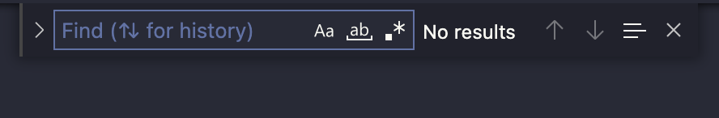
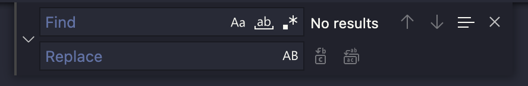

A quick reminder to use regular expressions in VS Code. This is a feature I use frequently, but not enough to remember the patterns when I need them.

## What is the regular expression engine?

Regular expressions may be in `ECMAScript 5` or `PCRE2` format.

## Opening the search/replace widget

To start a search, simply use `Ctrl + F` or for MacOS `Cmd + F` to open this widget:

To start a search with replacement, simply use `Ctrl + Shift + F` or for MacOS `Cmd + Shift + F` which opens this widget:

To activate the regexes, click on `.*`.

## Entering regular expressions

I'm not going to rehash a course on regular expressions, but I'll take a few to give you a refresher. You can practice with the site [regex101.com](https://regex101.com/).

To search for a character in a set, just put `[]`. For example, a lowercase letter `[a-z]`, an upper or lowercase letter `[a-zA-Z]`, a number `[0_9]`, etc. You can add other characters to the list.

You can use `|` to specify one or more words: `me|you|we|you` searches for the words `me`, `you`, `we` or `you`.

**Special characters:**

- `\n` line break
- `\r` carriage return
- `\t` tabulation
- `\f` page break
- `\e` exhaust
- `^` designates the beginning of a line
- `$` designates the end of a line

**Shortcuts:**

- `\w` which is equivalent to `[a-zA-Z0-9_]`.
- `\W` to `[^a-zA-Z0-9_]` so the opposite of `\w`.
- `\s` to `[\r\n\t\f\v]`
- `\S` to all characters other than those of `\s`.
- `\d` to `[0-9]`
- `\D` to all non-numeric characters. `[^0-9]`
- `.` to any character except line break
- `\b` searches for all `\w` sequences whose first and/or last letter is the preceding one.

To set the number of occurrences of a character or set

- `?` to zero or one occurrence of a search
- `+` to one or more occurrences of a search.
- `*` to zero or more occurrences of a search.
- `{i,j}` same as above, but define the minimum and maximum number of repetitions.

**Capture:**

- `(...)` captures the content for reuse in the replace field with the `$n` character. `n` is the index of the `()` occurrence.

If you are looking for one of the reserved characters, you have to escape them with `\` : `$^.|?*+()[]{}`

## Some examples

**In an Ansible playbook, you forgot to surround a variable name with spaces.**

`"{{variable}}"` should be written as `"{{ variable }}"`.

We need to add escapes since we are looking for `{}`. :

- In the search field:  `\{\{(\w+)\}\}`
- In the replacement field: `{{ $1 }}`

**In job descriptions, we would like the first letter of the job to be capitalized.**

- In the search field: `(\s+) - name: (\w+)`
- In the replacement field: `$1 - name: \u$2`

In the result field, simply precede the occurrence of the capture with `\u`. To lowercase `\l`. To do so on the full word `\L` or `\U`.
