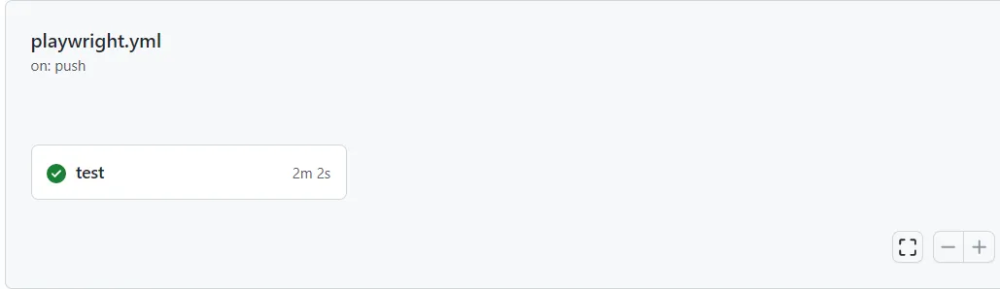
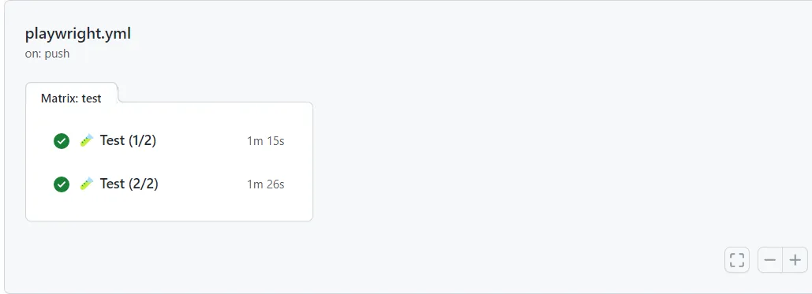
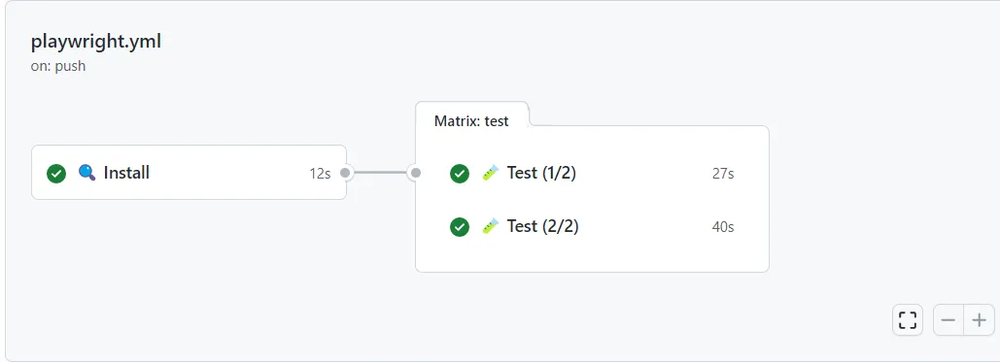

L'utilisation de la technique du test sharding signifie que la suite de tests est séparée en plusieurs morceaux (shards). Cela permet d'améliorer considérablement le temps d'exécution lorsque les différents morceaux sont testés simultanément. Pour ce faire, il faut distribuer les shards de test sur différentes machines.

Dans ce billet, nous verrons plus particulièrement comment répartir votre suite de tests Playwright. Pour tirer le meilleur parti de ces tests, nous configurons également un flux de travail GitHub pour exécuter ces tests en parallèle au cours d'une exécution CI.

## Les shards dans Playwright

Playwright prend en charge la [fonction de shard](https://playwright.dev/docs/test-parallel#shard-tests-between-multiple-machines) en utilisant l'option de `shard` qui peut être transmise par l'intermédiaire de l'interface de commande lorsque vous exécutez la commande de test. Le partage des tests avec Playwright est particulièrement utile lorsque la suite de tests est exécutée sur plusieurs navigateurs ou appareils.

Supposons que vous exécutiez vos tests Playwright sur deux navigateurs différents. Par défaut, la commande de test exécute les mêmes tests sur les deux navigateurs. Cependant, en divisant le flux de travail en deux zones, nous obtenons ce qui suit :

- un groupe pour exécuter la suite de tests sur le premier navigateur ;
- l'autre pour exécuter la même suite de tests sur le second navigateur ;

À titre d'exemple, examinons les commandes suivantes. En passant l'option `shard` à la commande `test`, le premier nombre (numérateur) représente le shard à exécuter, et le second nombre (dénominateur) est le nombre de shards dans lesquels la suite de tests est divisée.


```shell
# run against browser one
npx playwright test --shard=1/2
  Running 25 tests using 1 worker, shard 1 of 2
  25 passed (17s)
 
# run against browser two
npx playwright test --shard=2/2
  Running 25 tests using 1 worker, shard 2 of 2
  25 passed (19s)
```


Lorsque les commandes ci-dessus sont traduites en un flux de travail GitHub, nous obtenons le résultat suivant.


```yaml
jobs:
  test:
    steps:
    - uses: actions/checkout@v3
    - uses: actions/setup-node@v3
 
    - name: Install dependencies
      run: npm ci
 
    - name: Install Playwright Browsers
      run: npx playwright install --with-deps
 
    - name: Run Playwright tests (1/2)
      run: npx playwright test --shard=1/2
 
    - name: Run Playwright tests (2/2)
      run: npx playwright test --shard=2/2
```




## Jobs du flux de travail GitHub

Le simple fait d'utiliser des test shards ne change rien par rapport à la commande de test normale. Les tests sont partagés mais sont toujours exécutés en série, l'un après l'autre. Pour tirer parti de ces tests, ils doivent être exécutés en parallèle.

Pour exécuter plusieurs tâches en parallèle, le flux de travail GitHub ou Azure DevOps doit être divisé en tâches. Dans l'exemple ci-dessous, deux jobs sont créés et chaque job exécute son shard.


```yaml
jobs:
  test-one:
    name: 🧪 Test (1/2)
    steps:
    - uses: actions/checkout@v3
    - uses: actions/setup-node@v3
 
    - name: Install dependencies
      run: npm ci
 
    - name: Install Playwright Browsers
      run: npx playwright install --with-deps
 
    - name: Run Playwright tests
      run: npx playwright test --shard=1/2
 
  test-two:
    name: 🧪 Test (2/2)
    steps:
      - uses: actions/checkout@v3
      - uses: actions/setup-node@v3
 
      - name: Install dependencies
        run: npm ci
 
      - name: Install Playwright Browsers
        run: npx playwright install --with-deps
 
      - name: Run Playwright tests
        run: npx playwright test --shard=2/2
```




## Matrice du flux de travail GitHub

Comme vous pouvez le voir dans le flux de travail ci-dessus, la plupart des étapes sont dupliquées dans les deux jobs. En fait, seule l'option `shard` est différente. Cela peut devenir très lourd, et cela consomme également des ressources et du temps pour maintenir le flux de travail.

Imaginons maintenant qu'il y ait plus de deux unités de stockage et que le travail soit plus complexe (par exemple, plus d'étapes). Vous pouvez déjà voir que cela peut devenir un problème à l'avenir.

Pour améliorer le flux de travail, introduisez une matrice dans laquelle sont définies les différentes options des unités.

Après avoir déplacé les tessons dans une matrice, le flux de travail remanié se présente comme suit.


```yaml
jobs:
  test:
    name: name: 🧪 Test (${{ matrix.shard }}/${{ strategy.job-total }})
    strategy:
      matrix:
        shard: [1, 2]
    steps:
    - uses: actions/checkout@v3
    - uses: actions/setup-node@v3
 
    - name: Install dependencies
      run: npm ci
 
    - name: Install Playwright Browsers
      run: npx playwright install --with-deps
 
    - name: Run Playwright tests
      run: npx playwright test --shard=${{ matrix.shard }}/${{ strategy.job-total }}
```



## Mise en cache du flux de travail GitHub

Comme vous pouvez le constater, une matrice peut améliorer la lisibilité du flux de travail, le rendant plus propre car la duplication est supprimée. C'est beaucoup mieux, mais nous pouvons faire mieux.

Le résultat est qu'il y a maintenant deux tâches de test qui répètent les mêmes étapes "préliminaires". Parce que chaque job est exécuté sur une machine différente, cela signifie également que l'étape d'installation (dépendances des noeuds et binaires Playwright) est également exécutée deux fois.

Si cela devient un problème - dans la plupart des cas, ce n'est pas le cas - la solution est d'ajouter une mise en cache. Pour ce faire, divisez la tâche de test en deux tâches distinctes, une tâche d'installation et une tâche de test.

- Le job d'installation installe les dépendances requises et les ajoute à un cache.
- Au lieu d'installer les dépendances dans le job de test, ce dernier lit maintenant à partir du cache de constitution de l'étape précédente.

Il en résulte le flux de travail suivant.


```yaml
name: Playwright Tests
 
jobs:
  install:
    timeout-minutes: 60
    name: 🔍 Install
    runs-on: ubuntu-latest
    steps:
      - uses: actions/checkout@v3
      - uses: actions/setup-node@v3
 
      - name: Cache node_modules
        uses: actions/cache@v3
        id: cache-node-modules
        with:
          path: |
            node_modules
          key: modules-${{ hashFiles('package-lock.json') }}
 
      - name: Cache Playwright binaries
        uses: actions/cache@v3
        id: cache-playwright
        with:
          path: |
            ~/.cache/ms-playwright
          key: playwright-${{ hashFiles('package-lock.json') }}
 
      - name: Install dependencies
        if: steps.cache-node-modules.outputs.cache-hit != 'true'
        run: npm ci
 
      - name: Install Playwright Browsers
        if: steps.cache-playwright.outputs.cache-hit != 'true'
        run: npx playwright install --with-deps
 
  test:
    name: 🧪 Test (${{ matrix.shard }}/${{ strategy.job-total }})
    needs: install
    timeout-minutes: 60
    runs-on: ubuntu-latest
    strategy:
      fail-fast: false
      matrix:
        shard: [1, 2]
    steps:
      - uses: actions/checkout@v3
      - uses: actions/setup-node@v3
 
      - name: Cache node_modules
        uses: actions/cache@v3
        with:
          path: |
            node_modules
          key: modules-${{ hashFiles('package-lock.json') }}
 
      - name: Cache Playwright
        uses: actions/cache@v3
        with:
          path: |
            ~/.cache/ms-playwright
          key: playwright-${{ hashFiles('package-lock.json') }}
 
      - name: Run Playwright tests
        run: npx playwright test --shard=${{ matrix.shard }}/${{ strategy.job-total }}
 
      - uses: actions/upload-artifact@v3
        if: always()
        with:
          name: playwright-report-${{ matrix.shard }}_${{ strategy.job-total }}
          path: playwright-report
          retention-days: 30
```




L'étape d'installation étant supprimée, le temps d'exécution du flux de travail s'en trouve également réduit. Mais cela n'est pas sans coût, l'ajout d'une couche de mise en cache doit être maintenu, et peut également entraîner des bogues difficiles à trouver.

## Résultat

La combinaison de test shards avec des tâches parallèles permet de maintenir le temps d'exécution de votre suite de tests à un strict minimum.
