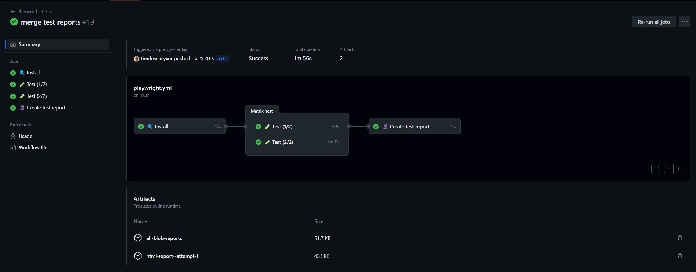

Dans un précédent billet de blog, "[L'utilisation de tests Playwright en combinaison avec une matrice de tâches pour améliorer la vitesse de la CI](/blog/2023-06_playwright-test-shards/)", nous avons vu comment diviser notre suite de tests Playwright en plusieurs lots afin d'accélérer le pipeline de construction.

La configuration présentée dans cet article de blog a créé plusieurs rapports de test, un pour chaque groupe. Le seul inconvénient est que nous n'avions pas de vue d'ensemble de tous les tests, ce qui rendait un peu plus difficile la recherche d'un rapport de test. Par exemple, lorsqu'un test échouait, il fallait d'abord connaître l'unité de stockage pour ouvrir le rapport de test correspondant.

Playwright v1.37.0 change cela en offrant la possibilité de fusionner les différents rapports de test en un seul.

Le résultat est une belle pipeline, avec un seul rapport de test comme résultat grâce à la nouvelle commande merge-reports.



## Changer le rapporteur du test

Ensuite, le rapporteur doit être modifié. Actuellement, le rapporteur exporte les résultats des tests dans un fichier HTML, mais ceux-ci ne peuvent pas être combinés en un seul rapport. Au lieu d'exporter les résultats des tests dans un rapport HTML, nous voulons qu'il s'agisse d'un format de fichier qui puisse être traité et fusionné ultérieurement.

Pour mettre à jour le rapporteur, modifiez-le dans la configuration de Playwright pour créer un `blob` au lieu d'un fichier `HTML`. Avec cette modification, le répertoire de sortie contenant les fichiers de résultats des tests est également différent, et passe de `playwright-report` à `blob-report`.

Il en résulte un fichier zip contenant un fichier JSON avec les résultats du test.


```typescript
import type { PlaywrightTestConfig } from "@playwright/test";
 
const config: PlaywrightTestConfig = {
  reporter: process.env.CI ? 'blob' : 'html',
}
```


La modification ci-dessus n'utilise le format blob que dans un environnement d'intégration continue (en utilisant la variable d'environnement `process.env.CI`), en d'autres termes dans votre pipeline de construction. Vous pouvez également l'activer pour votre environnement local si vous le souhaitez, par exemple lorsque vous utilisez également le sharding de test lors de l'exécution locale de votre suite de tests.

## Création d'un rapport de test à partir du lien vers les fichiers blob

Pour créer un rapport de test HTML, la dernière étape consiste à fusionner les différents fichiers blob. Heureusement, nous n'avons pas besoin de le faire manuellement, mais nous pouvons utiliser la nouvelle commande `merge-reports`.

Indiquez-lui l'emplacement de vos fichiers blob.


```shell
npx playwright merge-reports --reporter html ./blob-reports
```


## Mise à jour du pipeline CI (GitHub Actions)

Maintenant que cela fonctionne, il est temps de mettre à jour notre pipeline et d'y apporter les modifications ci-dessus.

Puisque la sortie des résultats de test est changée en `blob-report`, nous devons mettre à jour l'étape de téléchargement de l'artefact. Une note en passant : lors de la mise à jour de l'étape, vous pouvez également réduire le temps de rétention parce que ces fichiers seront remplacés par le fichier de sortie unique qui sera créé ensuite.


```yaml
 name: Upload temp reports
  if: always()
  uses: actions/upload-artifact@v3
  with:
    name: all-blob-reports
    path: blob-report
    retention-days: 1
```


Cette modification entraîne toujours la création de plusieurs fichiers de sortie. Pour fusionner les fichiers, nous utilisons la commande `merge-reports` dans une tâche supplémentaire. Ce job télécharge tous les rapports blob créés par les jobs sharded, qui téléchargent tous leurs rapports individuels en tant qu'artefact. Il s'agit d'une tâche supplémentaire car les groupes de test sont exécutés en parallèle, chacun dans son propre environnement isolé.


```yml
  create-report:
    name: 📔 Create test report
    if: always()
    # import to wait until all the test jobs have finished
    needs: [test]
 
    runs-on: ubuntu-latest
    steps:
    - uses: actions/checkout@v3
    - uses: actions/setup-node@v3
 
    - name: Install dependencies
      run: npm ci
 
    - name: Download blob reports from GitHub Actions Artifacts
      uses: actions/download-artifact@v3
      with:
        name: all-blob-reports
        path: all-blob-reports
 
    - name: Merge into HTML Report
      run: npx playwright merge-reports --reporter html ./all-blob-reports
 
    - name: Upload HTML report
      uses: actions/upload-artifact@v3
      with:
        name: html-report--attempt-${{ github.run_attempt }}
        path: playwright-report
        retention-days: 7
```


La dernière étape de la tâche de création de rapport ci-dessus télécharge le rapport groupé en tant qu'artefact du pipeline.

## Résultat

Ces changements ont pour résultat le pipeline suivant :


Le fichier complet du flux de travail GitHub se présente comme suit :


```yml
name: Playwright Tests
 
on:
  push:
    branches: [main, master]
  pull_request:
    branches: [main, master]
 
jobs:
  install:
    timeout-minutes: 60
    name: 🔍 Install
    runs-on: ubuntu-latest
    steps:
      - uses: actions/checkout@v3
      - uses: actions/setup-node@v3
 
      - name: Cache node_modules
        uses: actions/cache@v3
        id: cache-node-modules
        with:
          path: |
            node_modules
          key: modules-${{ hashFiles('package-lock.json') }}
 
      - name: Cache Playwright binaries
        uses: actions/cache@v3
        id: cache-playwright
        with:
          path: |
            ~/.cache/ms-playwright
          key: playwright-${{ hashFiles('package-lock.json') }}
 
      - name: Install dependencies
        if: steps.cache-node-modules.outputs.cache-hit != 'true'
        run: npm ci
 
      - name: Install Playwright Browsers
        if: steps.cache-playwright.outputs.cache-hit != 'true'
        run: npx playwright install --with-deps
 
  test:
    name: 🧪 Test (${{ matrix.shard }}/${{ strategy.job-total }})
    needs: install
    timeout-minutes: 60
    runs-on: ubuntu-latest
    strategy:
      fail-fast: false
      matrix:
        shard: [1, 2]
    steps:
      - uses: actions/checkout@v3
      - uses: actions/setup-node@v3
 
      - name: Cache node_modules
        uses: actions/cache@v3
        with:
          path: |
            node_modules
          key: modules-${{ hashFiles('package-lock.json') }}
 
      - name: Cache Playwright
        uses: actions/cache@v3
        with:
          path: |
            ~/.cache/ms-playwright
          key: playwright-${{ hashFiles('package-lock.json') }}
 
      - name: Run Playwright tests
        run: npx playwright test --shard=${{ matrix.shard }}/${{ strategy.job-total }}
 
      - name: Upload report
        if: always()
        uses: actions/upload-artifact@v3
        with:
          name: all-blob-reports
          path: blob-report
          retention-days: 1
 
  create-report:
    name: 📔 Create test report
    if: always()
    needs: [test]
 
    runs-on: ubuntu-latest
    steps:
    - uses: actions/checkout@v3
    - uses: actions/setup-node@v3
 
    - name: Install dependencies
      run: npm ci
 
    - name: Download blob reports from GitHub Actions Artifacts
      uses: actions/download-artifact@v3
      with:
        name: all-blob-reports
        path: all-blob-reports
 
    - name: Merge into HTML Report
      run: npx playwright merge-reports --reporter html ./all-blob-reports
 
    - name: Upload HTML report
      uses: actions/upload-artifact@v3
      with:
        name: html-report--attempt-${{ github.run_attempt }}
        path: playwright-report
        retention-days: 7
```

