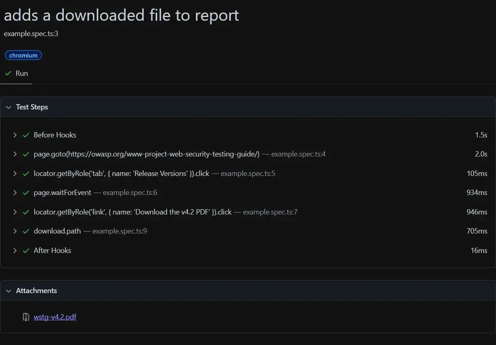
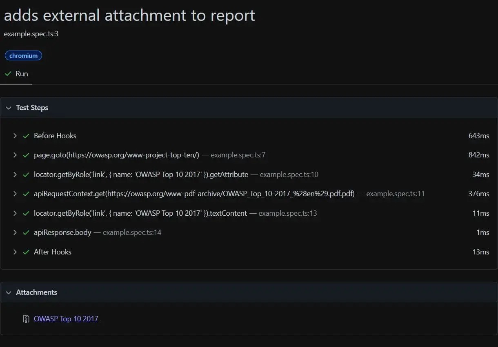
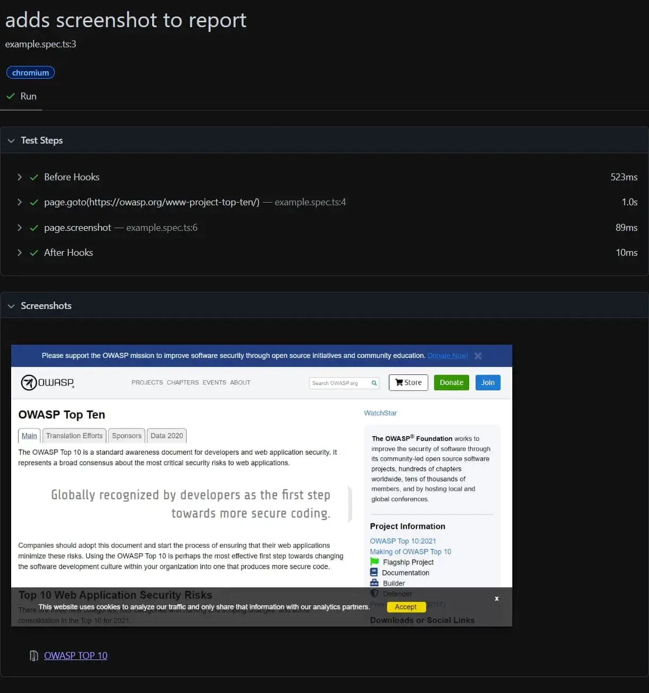

Les tests automatisés avec Playwright sont un excellent moyen de s'assurer que votre application fonctionne correctement, mais tester un fichier peut s'avérer difficile.

Il ne s'agit pas d'une tâche simple à automatiser et elle doit être testée par un humain pour être complète. Cependant, nous pouvons faire de notre mieux pour rendre cette tâche plus facile que d'avoir à ouvrir manuellement l'application, puis à interagir avec elle, juste pour télécharger le fichier. Cela peut être acceptable une ou deux fois, mais cela devient rapidement une tâche fastidieuse. Par conséquent, ce test sera "oublié".

Heureusement, Playwright a une solution. En ajoutant le fichier au rapport de test - qui peut ensuite être inclus dans un artefact créé par un pipeline - le testeur peut facilement accéder au fichier et le télécharger pour le vérifier.

Dans ce billet, je vais vous montrer plusieurs façons d'ajouter un fichier (ou une capture d'écran) à votre rapport Playwright en utilisant [testInfo.attach](https://playwright.dev/docs/api/class-testinfo#test-info-attach). Pour utiliser `TestInfo`, ajoutez-le comme deuxième paramètre de la méthode de test.

## Ajouter un fichier téléchargé au lien du rapport

La première option consiste à ajouter un fichier téléchargé par le navigateur:

- Créez d'abord un "hook" qui attend le téléchargement, puis cliquez sur l'élément pour lancer le téléchargement (2).
- Ajoutez le fichier au rapport, utilisez suggestedFilename pour obtenir le nom du fichier, et path pour inclure le chemin temporaire du fichier téléchargé (3).


```ts
import { test } from '@playwright/test';
 
test('adds a downloaded file to report', async ({ page }, testInfo) => {
    // 1. Navigate to the page
    await page.goto('https://owasp.org/www-project-web-security-testing-guide/');
    await page.getByRole('tab', { name: 'Release Versions' }).click();
 
    // 2. Wait for the download
    const downloadPromise = page.waitForEvent('download');
    await page.getByRole('link', { name: 'Download the v4.2 PDF' }).click();
    const download = await downloadPromise;
 
    // 3. Add the PDF to the report
    const path = await download.path();
    await testInfo.attach(download.suggestedFilename(), {
        path: path!,
    });
});
```




## Ajouter un fichier externe au lien du rapport

La deuxième solution consiste à ajouter un fichier disponible sous forme d'URL :

- La première étape consiste à récupérer l'URL du fichier (2)
- Ensuite, utiliser l'[APIRequestContext](https://playwright.dev/docs/api/class-apirequestcontext) pour télécharger le fichier (3)
- Enfin, ajouter le fichier au rapport en ajoutant le corps de la requête (4)


```ts
import { test } from '@playwright/test';
 
test('adds an external file to report', async ({ page, request }, testInfo) => {
    // 1. Navigate to the page
    await page.goto('https://owasp.org/www-project-top-ten/');
 
    // 2. Grab the PDF link
    const link = await page.getByRole('link', { name: 'OWASP Top 10 2017' });
    const href = await link.getAttribute('href');
 
    // 3. Download the PDF
    const pdfRequest = await request.get('https://owasp.org' + href);
 
    // 4. Add the PDF to the report
    await testInfo.attach((await link.textContent())!, {
        body: await pdfRequest.body(),
    });
});
```




## Ajouter une capture d'écran au lien du rapport

La dernière solution consiste à faire une capture d'écran de la page et à la joindre au rapport. Pour ce faire, il suffit de prendre une capture d'écran de la page ou d'un élément spécifique de la page,

- Faites simplement une capture d'écran de la page ou d'un élément spécifique de la page (2)
- Inclure l'image en utilisant `body` et définir le type de contenu en utilisant contentType (3)


```ts
import { test } from '@playwright/test';
 
test('adds a screenshot to report', async ({ page }, testInfo) => {
    // 1. Navigate to the page
    await page.goto('https://owasp.org/www-project-top-ten/');
 
    // 2. Take a screenshot
    const screenshot = await page.screenshot();
 
    // 3. Add the screenshot to the report
    await testInfo.attach('OWASP TOP 10', {
        body: screenshot,
        contentType: 'image/png',
    });
});
```




## Conclusion

Dans cet article, nous avons vu comment nous pouvons attacher différents fichiers en pièce jointe au rapport Playwright. Il est ainsi plus facile d'accéder à ces fichiers pour en vérifier l'exactitude.

Même si ces fichiers ne sont pas vérifiés à chaque exécution, nous pouvons conserver un historique de ces fichiers. Dans le cas où quelque chose n'est pas correct, nous pouvons remonter dans le temps et repérer le commit exact qui a causé la différence.
