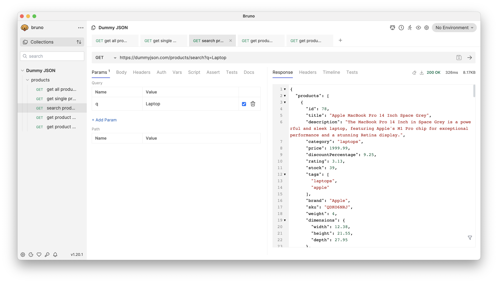

## Bruno : une alternative sécurisée et conviviale à Postman

[Bruno](https://www.usebruno.com/) est un nouveau client API innovant, conçu pour remettre en question le statu quo représenté par Postman et d'autres outils similaires.

L'approche unique de Bruno consiste à stocker vos collections directement sur votre système de fichiers. Nous utilisons un langage de balisage en texte, `Bru`, pour enregistrer les informations relatives aux demandes d'API. Cela signifie que vous avez un contrôle total sur vos données et que vous pouvez facilement suivre les changements.

De plus, la conception de Bruno vous permet d'utiliser Git ou tout autre système de contrôle de version de votre choix pour collaborer sur vos collections d'API. Bruno n'est donc pas seulement un outil de test d'API, mais aussi une plateforme pour une collaboration efficace et effective au sein d'une équipe.

## Pourquoi abandonner Postman et Insomnia ?

Dans le monde des tests d'API, Postman et Insomnia ont été des choix populaires. Toutefois, des changements récents ont soulevé des inquiétudes concernant la sécurité des données et la fonctionnalité hors ligne.

**Postman** a annoncé en mai 2023 l'abandon progressif de son modèle Scratch Pad avec des fonctionnalités hors ligne. La plupart des fonctions nécessiteront désormais un accès au cloud et une connexion de l'utilisateur. L'étendue des données sont transfèrer vers le cloud pendant les tests, qui pourrait compromettre la sécurité, reste incertaine.
[Pour en savoir plus](https://www.leeholmes.com/security-risks-of-postman/)

**Insomnia** a publié la version 8.0 le 28 septembre 2023, renforçant sa dépendance à l'égard du cloud. Pour bénéficier de toutes les fonctionnalités, l'utilisateur doit désormais se connecter, et les fonctions du Scratch Pad sont limitées sans cette connexion. Les implications en termes de sécurité d'une éventuelle transmission de données vers le cloud pendant les tests ne sont pas claires.

Compte tenu de ces changements, le besoin d'une solution de test d'API qui isole les données de l'espace de travail des serveurs tiers se fait de plus en plus sentir. C'est là qu'intervient Bruno.

## Pourquoi choisir Bruno ?

Bruno offre une alternative sécurisée et conviviale pour vos besoins en matière de tests d'API. Voici pourquoi vous devriez envisager de passer à Bruno :

- **Open Source**: Bruno est un logiciel open-source sous licence MIT, favorisant un environnement de développement collaboratif et transparent.
- **Support multiplateforme**: Bruno prend en charge Mac, Linux et Windows, ce qui en fait un choix polyvalent pour diverses équipes.
- **Client hors ligne**: Contrairement à ses concurrents, Bruno ne prévoit pas de synchronisation dans le nuage, ce qui donne la priorité à la sécurité de vos données.
- **Importation de scripts**: Bruno prend en charge l'importation de scripts depuis Postman et Insomnia (limitée aux scripts de demande d'API, à l'exclusion des scripts de test), ce qui facilite le processus de transition.
- **Communauté active**: Bruno bénéficie d'une communauté relativement active et d'une feuille de route claire pour le développement du produit, ce qui garantit une amélioration et un support continus.

## Transition transparente avec Bruno

L'une des caractéristiques les plus remarquables de Bruno est sa capacité à importer des collections existantes à partir de différents outils. Cela signifie que vous pouvez facilement transférer votre flux de travail de test d'API sans partir de zéro.

- **Collections Postman**: Bruno prend en charge l'importation de collections Postman. Cela vous permet d'importer toutes vos demandes d'API sauvegardées, en conservant l'organisation et la structure qui vous sont familières.
- **Collections Insomnia**: Si vous venez d'Insomnia, Bruno vous couvre. Vous pouvez importer vos collections Insomnia et vous assurer que vos tests d'API se poursuivent sans problème.
- **OpenAPI v3 Spec**: Bruno prend également en charge l'importation des spécifications OpenAPI v3. Cela signifie que vous pouvez tirer parti de votre conception et de votre documentation API existantes, ce qui fait de Bruno un choix polyvalent pour les tests d'API.

Cette fonctionnalité d'importation fait de Bruno un outil flexible qui s'adapte à vos besoins, réduisant ainsi la friction généralement associée au passage à une nouvelle plateforme de test d'API.

Pour plus d'informations, consultez la [documentation officielle](https://github.com/usebruno/bruno/discussions/269) et la [comparaison avec Postman](https://www.usebruno.com/compare/bruno-vs-postman).
